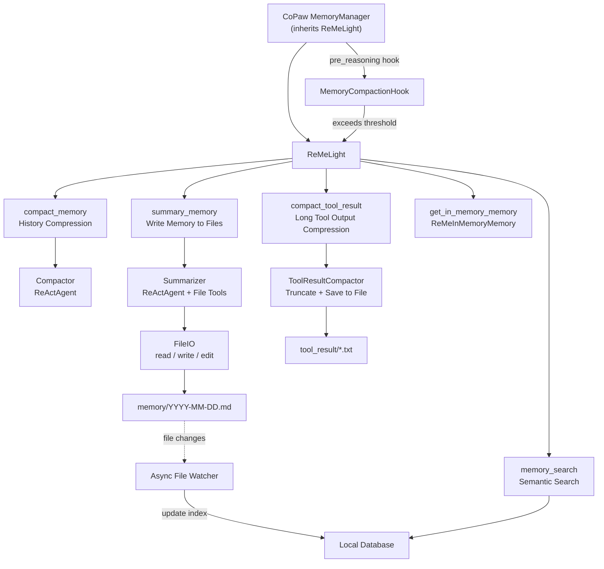
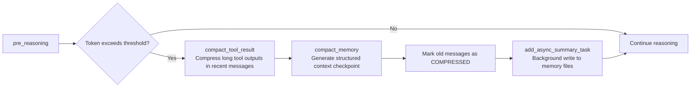
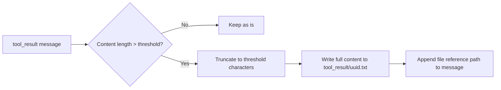
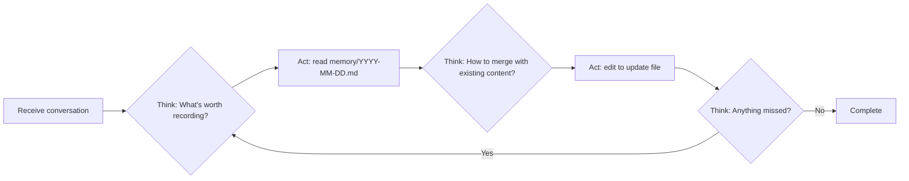
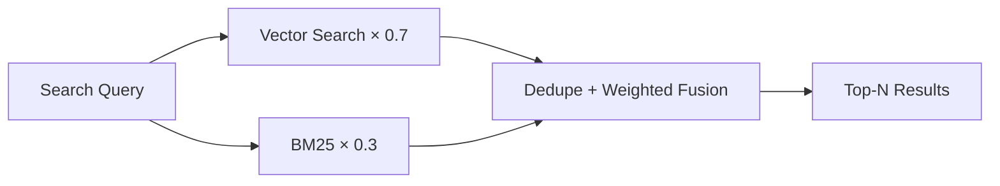
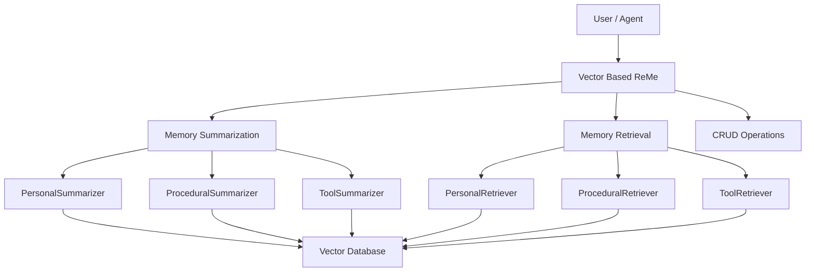

<p align="center">
 
</p>

<p align="center">
  <a href="https://pypi.org/project/reme-ai/"></a>
  <a href="https://pypi.org/project/reme-ai/"></a>
  <a href="https://pepy.tech/project/reme-ai/"></a>
  <a href="https://github.com/agentscope-ai/ReMe"></a>
</p>

<p align="center">
  <a href="./LICENSE"></a>
  <a href="./README.md"></a>
  <a href="./README_ZH.md"></a>
  <a href="https://github.com/agentscope-ai/ReMe"></a>
</p>

<p align="center">
  <strong>Memory Management Toolkit for AI Agents, Remember Me, Refine Me.</strong><br>
</p>

> For legacy versions, please refer to [0.2.x Documentation](docs/README_0_2_x.md)

---

🧠 ReMe is a memory management framework built specifically for **AI Agents**, offering both file-based and vector-based memory systems.

It addresses two core memory challenges for agents: **Limited context window** (early information gets truncated or lost in long conversations), and **Stateless sessions** (new conversations cannot inherit history, starting from scratch every time).

ReMe gives agents **true memory capability** — old conversations are automatically condensed, important information is persistently stored, and relevant context is automatically recalled in future conversations.

---

## 📁 File-Based Memory System

> Memory as Files, Files as Memory

Treat **memory as files** — readable, editable, and copyable. [CoPaw](https://github.com/agentscope-ai/CoPaw)'s memory system inherits from `ReMeLight`, implementing memory management capabilities.

| Traditional Memory System | File Based ReMe    |
|---------------------------|-------------------|
| 🗄️ Database storage       | 📝 Markdown files |
| 🔒 Invisible               | 👀 Always readable |
| ❌ Hard to modify          | ✏️ Direct editing  |
| 🚫 Hard to migrate         | 📦 Copy to migrate |

```
working_dir/
├── MEMORY.md              # Long-term memory: user preferences, project configs, etc.
├── memory/
│   └── YYYY-MM-DD.md      # Daily summary logs: auto-written after conversations
└── tool_result/           # Long tool output cache (auto-managed, auto-cleanup on expiry)
    └── <uuid>.txt
```

### Core Capabilities

[ReMeLight](reme/reme_light.py) is the core class of this memory system, providing complete memory management capabilities for AI Agents:

| Method                    | Function                    | Key Components                                                                                                      |
|---------------------------|-----------------------------|---------------------------------------------------------------------------------------------------------------------|
| `start`                   | 🚀 Start memory system       | Initialize file store, file watcher, embedding cache; cleanup expired tool result files                           |
| `close`                   | 📕 Close and cleanup         | Cleanup tool result files, stop file watcher, save embedding cache                                                 |
| `compact_memory`          | 📦 Compress history to summary | [Compactor](reme/memory/file_based/compactor.py) — ReActAgent generates structured context checkpoints           |
| `summary_memory`          | 📝 Write important memories to files | [Summarizer](reme/memory/file_based/summarizer.py) — ReActAgent + file tools (read / write / edit)              |
| `compact_tool_result`     | ✂️ Compress long tool outputs | [ToolResultCompactor](reme/memory/file_based/tool_result_compactor.py) — Truncate and save to `tool_result/`, keep file reference in message |
| `add_async_summary_task`  | ⚡ Submit background summary task | `asyncio.create_task`, summary doesn't block main conversation flow                                              |
| `await_summary_tasks`     | ⏳ Wait for background tasks  | Collect results from all background summary tasks, call before closing to ensure writes complete                 |
| `memory_search`           | 🔍 Semantic memory search    | [MemorySearch](reme/memory/tools/chunk/memory_search.py) — Vector + BM25 hybrid retrieval                        |
| `get_in_memory_memory`    | 🗂️ Create in-memory instance | [ReMeInMemoryMemory](reme/memory/file_based/reme_in_memory_memory.py) — Token-aware memory management, supports compression summaries and state serialization |
| `update_params`           | ⚙️ Dynamically update runtime params | Runtime adjustment of `max_input_length`, `memory_compact_ratio`, `language`                                    |

---

## 🚀 Quick Start

### Installation

```bash
pip install -U reme-ai[as]
```

### Environment Variables

`ReMeLight` environment variables configure embedding and storage backends

| Environment Variable        | Description                          | Default                                             |
|-----------------------------|--------------------------------------|-----------------------------------------------------|
| `EMBEDDING_API_KEY`         | Embedding service API Key            | `""`                                                |
| `EMBEDDING_BASE_URL`        | Embedding service Base URL           | `https://dashscope.aliyuncs.com/compatible-mode/v1` |
| `EMBEDDING_MODEL_NAME`      | Embedding model name                 | `""`                                                |
| `EMBEDDING_DIMENSIONS`      | Vector dimensions                    | `1024`                                              |
| `EMBEDDING_CACHE_ENABLED`   | Enable embedding cache               | `true`                                              |
| `EMBEDDING_MAX_CACHE_SIZE`  | Maximum cache entries                | `2000`                                              |
| `FTS_ENABLED`               | Enable full-text search (BM25)       | `true`                                              |
| `MEMORY_STORE_BACKEND`      | Storage backend (`auto` / `chroma` / `local`) | `auto` (local on Windows, chroma otherwise)  |

```python
import asyncio

from agentscope.message import Msg
from reme.reme_light import ReMeLight

async def main():
    reme = ReMeLight(
        working_dir=".reme",  # Memory file storage directory
        max_input_length=128000,  # Model context window (tokens)
        memory_compact_ratio=0.7,  # Trigger compression at max_input_length * 0.7
        language="zh",  # Summary language (zh / "")
        tool_result_threshold=1000,  # Auto-save tool outputs exceeding this character count
        retention_days=7,  # tool_result/ file retention days
    )
    await reme.start()

    messages = [...]

    # 1. Compress long tool outputs (prevent tool results from bloating context)
    messages = await reme.compact_tool_result(messages)

    # 2. Compress conversation history to structured summary (triggered when context approaches limit), pass previous summary for incremental updates
    summary = await reme.compact_memory(messages=messages, previous_summary="")

    # 3. Submit async summary task in background (non-blocking, writes to memory/YYYY-MM-DD.md)
    reme.add_async_summary_task(messages=messages)

    # 4. Semantic memory search (Vector + BM25 hybrid retrieval)
    result = await reme.memory_search(query="Python version preference", max_results=5)

    # 5. Get in-memory instance (ReMeInMemoryMemory, manages single conversation context) AgentScope InMemoryMemory
    memory = reme.get_in_memory_memory()
    token_stats = await memory.estimate_tokens()
    print(f"Current context usage: {token_stats['context_usage_ratio']:.1f}%")
    print(f"Message tokens: {token_stats['messages_tokens']}")
    print(f"Estimated total tokens: {token_stats['estimated_tokens']}")

    # 6. Wait for background tasks before closing
    summary_result = await reme.await_summary_tasks()

    # Close ReMeLight
    await reme.close()


if __name__ == "__main__":
    asyncio.run(main())
```

#### Vector-Based ReMe

## 🗃️ Vector-Based ReMe

[ReMe Vector Based](reme/reme.py) is the core class of the vector-based memory system, supporting unified management of three memory types:

| Memory Type          | Purpose                              | Use Case     |
|----------------------|--------------------------------------|--------------|
| **Personal Memory**  | Record user preferences, habits      | `user_name`  |
| **Task/Procedural Memory** | Record task execution experience, success/failure patterns | `task_name`  |
| **Tool Memory**      | Record tool usage experience, parameter optimization | `tool_name`  |

### Core Capabilities

| Method              | Function         | Description                        |
|---------------------|------------------|------------------------------------|
| `summarize_memory`  | 🧠 Memory Summary | Auto-extract and store memories from conversations |
| `retrieve_memory`   | 🔍 Memory Retrieval | Retrieve relevant memories based on query |
| `add_memory`        | ➕ Add Memory     | Manually add memory to vector store |
| `get_memory`        | 📖 Get Memory     | Get single memory by ID            |
| `update_memory`     | ✏️ Update Memory  | Update existing memory content or metadata |
| `delete_memory`     | 🗑️ Delete Memory | Delete specified memory            |
| `list_memory`       | 📋 List Memories  | List memories by type, supports filtering and sorting |

```python
import asyncio
from reme import ReMe


async def main():
    # Initialize ReMe
    reme = ReMe(
        working_dir=".reme",
        default_llm_config={
            "backend": "openai",
            "model_name": "qwen3.5-plus",
        },
        default_embedding_model_config={
            "backend": "openai",
            "model_name": "text-embedding-v4",
            "dimensions": 1024,
        },
        default_vector_store_config={
            "backend": "local",  # Supports local/chroma/qdrant/elasticsearch
        },
    )
    await reme.start()

    messages = [
        {"role": "user", "content": "Help me write a Python script", "time_created": "2026-02-28 10:00:00"},
        {"role": "assistant", "content": "OK, let me help you", "time_created": "2026-02-28 10:00:05"},
    ]

    # 1. Summarize memories from conversation (auto-extract user preferences, task experience, etc.)
    result = await reme.summarize_memory(
        messages=messages,
        user_name="alice",  # Personal memory
        # task_name="code_writing",  # Task memory
    )
    print(f"Summary result: {result}")

    # 2. Retrieve relevant memories
    memories = await reme.retrieve_memory(
        query="Python programming",
        user_name="alice",
        # task_name="code_writing",
    )
    print(f"Retrieval result: {memories}")

    # 3. Manually add memory
    memory_node = await reme.add_memory(
        memory_content="User prefers concise code style",
        user_name="alice",
    )
    print(f"Added memory: {memory_node}")
    memory_id = memory_node.memory_id

    # 4. Get single memory by ID
    fetched_memory = await reme.get_memory(memory_id=memory_id)
    print(f"Fetched memory: {fetched_memory}")

    # 5. Update memory content
    updated_memory = await reme.update_memory(
        memory_id=memory_id,
        user_name="alice",
        memory_content="User prefers concise code style with comments",
    )
    print(f"Updated memory: {updated_memory}")

    # 6. List all user memories (supports filtering and sorting)
    all_memories = await reme.list_memory(
        user_name="alice",
        limit=10,
        sort_key="time_created",
        reverse=True,
    )
    print(f"User memory list: {all_memories}")

    # 7. Delete specified memory
    await reme.delete_memory(memory_id=memory_id)
    print(f"Deleted memory: {memory_id}")

    # 8. Delete all memories (use with caution)
    # await reme.delete_all()

    await reme.close()


if __name__ == "__main__":
    asyncio.run(main())
```

## 🏛️ Technical Architecture

### File-Based ReMeLight Memory System Architecture

[CoPaw MemoryManager](https://github.com/agentscope-ai/CoPaw/blob/main/src/copaw/agents/memory/memory_manager.py) inherits from `ReMeLight`, integrating memory capabilities into the Agent reasoning flow:


```mermaid
graph TB
    CoPaw["CoPaw MemoryManager\n(inherits ReMeLight)"] -->|pre_reasoning hook| Hook[MemoryCompactionHook]
    CoPaw --> ReMeLight[ReMeLight]
    Hook -->|exceeds threshold| ReMeLight
    ReMeLight --> CompactMemory[compact_memory\nHistory Compression]
    ReMeLight --> SummaryMemory[summary_memory\nWrite Memory to Files]
    ReMeLight --> CompactToolResult[compact_tool_result\nLong Tool Output Compression]
    ReMeLight --> MemSearch[memory_search\nSemantic Search]
    ReMeLight --> InMemory[get_in_memory_memory\nReMeInMemoryMemory]
    CompactMemory --> Compactor[Compactor\nReActAgent]
    SummaryMemory --> Summarizer[Summarizer\nReActAgent + File Tools]
    CompactToolResult --> ToolResultCompactor[ToolResultCompactor\nTruncate + Save to File]
    Summarizer --> FileIO[FileIO\nread / write / edit]
    FileIO --> MemoryFiles[memory/YYYY-MM-DD.md]
    ToolResultCompactor --> ToolResultFiles[tool_result/*.txt]
    MemoryFiles -.->|file changes| FileWatcher[Async File Watcher]
    FileWatcher -->|update index| FileStore[Local Database]
    MemSearch --> FileStore
```

#### Auto-Compression Trigger Flow

`MemoryCompactionHook` checks context token usage before each reasoning step, automatically triggering compression when threshold is exceeded:


```mermaid
graph LR
    A[pre_reasoning] --> B{Token exceeds threshold?}
    B -->|No| Z[Continue reasoning]
    B -->|Yes| C[compact_tool_result\nCompress long tool outputs in recent messages]
    C --> D[compact_memory\nGenerate structured context checkpoint]
    D --> E[Mark old messages as COMPRESSED]
    E --> F[add_async_summary_task\nBackground write to memory files]
    F --> Z
```

#### Context Compression Summary Format

[Compactor](reme/memory/file_based/compactor.py) uses ReActAgent to compress conversation history into structured **context checkpoints**:

| Field                  | Description                                  |
|------------------------|----------------------------------------------|
| `## Goal`              | 🎯 Goals the user wants to accomplish (can be multiple) |
| `## Constraints`       | ⚙️ Constraints and preferences mentioned by user |
| `## Progress`          | 📈 Completed / In-progress / Blocked tasks   |
| `## Key Decisions`     | 🔑 Decisions made with brief rationale       |
| `## Next Steps`        | 🗺️ Next action plan (ordered list)          |
| `## Critical Context`  | 📌 Key data like file paths, function names, error messages |

Supports **incremental updates**: When `previous_summary` is provided, new conversation is automatically merged with old summary, preserving historical progress.

#### Tool Result Compression

[ToolResultCompactor](reme/memory/file_based/tool_result_compactor.py) solves the problem of context bloat caused by overly long tool outputs:


```mermaid
graph LR
    A[tool_result message] --> B{Content length > threshold?}
    B -->|No| C[Keep as is]
    B -->|Yes| D[Truncate to threshold characters]
    D --> E[Write full content to tool_result/uuid.txt]
    E --> F[Append file reference path to message]
```

Expired files (exceeding `retention_days`) are automatically cleaned up during `start` / `close` / `compact_tool_result`.

#### Memory Summarization: ReAct + File Tools

[Summarizer](reme/memory/file_based/summarizer.py) uses the **ReAct + File Tools** pattern, letting AI autonomously decide what to write and where:


```mermaid
graph LR
    A[Receive conversation] --> B{Think: What's worth recording?}
    B --> C[Act: read memory/YYYY-MM-DD.md]
    C --> D{Think: How to merge with existing content?}
    D --> E[Act: edit to update file]
    E --> F{Think: Anything missed?}
    F -->|Yes| B
    F -->|No| G[Complete]
```

[FileIO](reme/memory/file_based/file_io.py) provides file operation tools:

| Tool    | Function                      | Use Case                          |
|---------|-------------------------------|-----------------------------------|
| `read`  | Read file content (supports line ranges) | View existing memories, avoid duplicate writes |
| `write` | Overwrite file                | Create new memory files or major restructuring |
| `edit`  | Replace after exact match     | Append new content or modify specific sections |

#### In-Memory Management

[ReMeInMemoryMemory](reme/memory/file_based/reme_in_memory_memory.py) extends AgentScope's `InMemoryMemory`:

| Feature                           | Description                              |
|-----------------------------------|------------------------------------------|
| `get_memory`                      | Filter messages by tag, auto-prepend compression summary at head |
| `estimate_tokens`                 | Precisely estimate current context token usage and utilization |
| `get_history_str`                 | Generate human-readable conversation history summary (with token stats) |
| `state_dict` / `load_state_dict`  | Support state serialization / deserialization (session persistence) |
| `mark_messages_compressed`        | Mark messages as compressed state        |
| `get_compressed_summary`          | Get compressed summary content           |

#### Memory Retrieval

[MemorySearch](reme/memory/tools/chunk/memory_search.py) provides **Vector + BM25 hybrid retrieval** capabilities:

| Retrieval Method | Advantage                               | Disadvantage                     |
|------------------|----------------------------------------|----------------------------------|
| **Vector Semantic** | Captures semantically similar but differently worded content | Weak on exact token matching   |
| **BM25 Full-text** | Excellent for exact token hits         | Cannot understand synonyms and paraphrases |

**Fusion Mechanism**: After dual-path recall, weighted sum is applied (Vector 0.7 + BM25 0.3), enabling both natural language and exact lookups to hit.


```mermaid
graph LR
    Q[Search Query] --> V[Vector Search × 0.7]
    Q --> B[BM25 × 0.3]
    V --> M[Dedupe + Weighted Fusion]
    B --> M
    M --> R[Top-N Results]
```

---

### Vector-Based ReMe Core Architecture

### Installation

```bash
pip install -U reme-ai
```

### Environment Variables

API keys are set via environment variables, can be written in `.env` file in project root:

| Environment Variable       | Description              | Example                                             |
|----------------------------|--------------------------|-----------------------------------------------------|
| `REME_LLM_API_KEY`         | LLM API Key              | `sk-xxx`                                            |
| `REME_LLM_BASE_URL`        | LLM Base URL             | `https://dashscope.aliyuncs.com/compatible-mode/v1` |
| `REME_EMBEDDING_API_KEY`   | Embedding API Key        | `sk-xxx`                                            |
| `REME_EMBEDDING_BASE_URL`  | Embedding Base URL       | `https://dashscope.aliyuncs.com/compatible-mode/v1` |


```mermaid
graph TB
    User[User / Agent] --> ReMe[Vector Based ReMe]
    ReMe --> Summarize[Memory Summarization]
    ReMe --> Retrieve[Memory Retrieval]
    ReMe --> CRUD[CRUD Operations]
    Summarize --> PersonalSum[PersonalSummarizer]
    Summarize --> ProceduralSum[ProceduralSummarizer]
    Summarize --> ToolSum[ToolSummarizer]
    Retrieve --> PersonalRet[PersonalRetriever]
    Retrieve --> ProceduralRet[ProceduralRetriever]
    Retrieve --> ToolRet[ToolRetriever]
    PersonalSum --> VectorStore[Vector Database]
    ProceduralSum --> VectorStore
    ToolSum --> VectorStore
    PersonalRet --> VectorStore
    ProceduralRet --> VectorStore
    ToolRet --> VectorStore
```

## ⭐ Community & Support

- **Star & Watch**: Star helps more agent developers discover ReMe; Watch keeps you informed about new releases and features.
- **Share Your Work**: Share what ReMe unlocked for your agent in Issues or Discussions — we'd love to showcase community achievements.
- **Need a Feature?** Submit a Feature Request, and we'll work with the community to improve.
- **Code Contributions**: All forms of code contributions are welcome, please see the [Contribution Guide](docs/contribution.md).
- **Acknowledgments**: Thanks to OpenClaw, Mem0, MemU, CoPaw, and other excellent open-source projects for their inspiration and help.

---

## 📄 Citation

```bibtex
@software{AgentscopeReMe2025,
  title = {AgentscopeReMe: Memory Management Kit for Agents},
  author = {ReMe Team},
  url = {https://reme.agentscope.io},
  year = {2025}
}
```

---

## ⚖️ License

This project is open-sourced under the Apache License 2.0, see the [LICENSE](./LICENSE) file for details.

---

## 📈 Star History

[](https://www.star-history.com/#agentscope-ai/ReMe&Date)
