<p align="center">
 
</p>

<p align="center">
  <a href="https://pypi.org/project/reme-ai/"></a>
  <a href="https://pypi.org/project/reme-ai/"></a>
  <a href="https://pepy.tech/project/reme-ai/"></a>
  <a href="https://github.com/agentscope-ai/ReMe"></a>
</p>

<p align="center">
  <a href="./LICENSE"></a>
  <a href="./README_EN.md"></a>
  <a href="./README.md"></a>
  <a href="https://github.com/agentscope-ai/ReMe"></a>
</p>

<p align="center">
  <strong>A memory management toolkit for AI agents — Remember Me, Refine Me.</strong><br>
</p>

> For legacy versions, see [0.2.x Documentation](docs/README_0_2_x.md)

---

🧠 ReMe is a **memory management framework** built for **AI agents**, offering both **file-based** and **vector-based**
memory systems.

It addresses two core problems of agent memory: **limited context windows** (early information gets truncated or lost
during
long conversations) and **stateless sessions** (new conversations cannot inherit history and always start from scratch).

ReMe gives agents **real memory** — old conversations are automatically condensed, important information is persisted,
and the next conversation can recall it automatically.

---

## 📁 File-Based ReMe

> Memory as files, files as memory

Treat **memory as files** — readable, editable, and portable.

| Traditional Memory Systems | File-Based ReMe    |
|----------------------------|--------------------|
| 🗄️ Database storage       | 📝 Markdown files  |
| 🔒 Opaque                  | 👀 Read anytime    |
| ❌ Hard to modify           | ✏️ Edit directly   |
| 🚫 Hard to migrate         | 📦 Copy to migrate |

```
.reme/
├── MEMORY.md          # Long-term memory: user preferences, project config, etc.
└── memory/
    └── YYYY-MM-DD.md  # Daily logs: work records for the day, written upon compact
```

### Core Capabilities

[ReMe File Based](reme/reme_fb.py) is the core class of the file-based memory system. It acts like an **intelligent
secretary**, managing all memory-related operations:

| Method          | Function                           | Key Components                                                                                                                                                                                                                                          |
|-----------------|------------------------------------|---------------------------------------------------------------------------------------------------------------------------------------------------------------------------------------------------------------------------------------------------------|
| `start`         | 🚀 Start memory system             | [BaseFileStore](reme/core/file_store/base_file_store.py) (local file storage)<br/>[BaseFileWatcher](reme/core/file_watcher/base_file_watcher.py) (file watcher)<br/>[BaseEmbeddingModel](reme/core/embedding/base_embedding_model.py) (embedding cache) |
| `close`         | 📕 Close and save                  | Close file store, stop file watcher, save embedding cache                                                                                                                                                                                               |
| `context_check` | 📏 Check context limit             | [ContextChecker](reme/memory/file_based/fb_context_checker.py)                                                                                                                                                                                          |
| `compact`       | 📦 Compact history to summary      | [Compactor](reme/memory/file_based/fb_compactor.py)                                                                                                                                                                                                     |
| `summary`       | 📝 Write important memory to files | [Summarizer](reme/memory/file_based/fb_summarizer.py)                                                                                                                                                                                                   |
| `memory_search` | 🔍 Semantic memory search          | [MemorySearch](reme/memory/tools/chunk/memory_search.py)                                                                                                                                                                                                |
| `memory_get`    | 📖 Read specified memory file      | [MemoryGet](reme/memory/tools/chunk/memory_get.py)                                                                                                                                                                                                      |

---

## 🗃️ Vector-Based ReMe

[ReMe Vector Based](reme/reme.py) is the core class for the vector-based memory system, supporting unified management of
three memory types:

| Memory Type                  | Purpose                                             | Usage Context |
|------------------------------|-----------------------------------------------------|---------------|
| **Personal memory**          | User preferences, habits                            | `user_name`   |
| **Task / procedural memory** | Task execution experience, success/failure patterns | `task_name`   |
| **Tool memory**              | Tool usage experience, parameter tuning             | `tool_name`   |

### Core Capabilities

| Method             | Function            | Description                                               |
|--------------------|---------------------|-----------------------------------------------------------|
| `summarize_memory` | 🧠 Summarize memory | Automatically extract and store memory from conversations |
| `retrieve_memory`  | 🔍 Retrieve memory  | Retrieve relevant memory by query                         |
| `add_memory`       | ➕ Add memory        | Manually add memory to vector store                       |
| `get_memory`       | 📖 Get memory       | Fetch a single memory by ID                               |
| `update_memory`    | ✏️ Update memory    | Update content or metadata of existing memory             |
| `delete_memory`    | 🗑️ Delete memory   | Delete specified memory                                   |
| `list_memory`      | 📋 List memory      | List memories with filtering and sorting                  |

---

## 💻 ReMeCli: Terminal Assistant with File-Based Memory

<table border="0" cellspacing="0" cellpadding="0" style="border: none;">
  <tr style="border: none;">
    <td width="10%" style="border: none; vertical-align: middle; text-align: center;">
      <strong>马<br>上<br>有<br>钱</strong>
    </td>
    <td width="80%" style="border: none;">
      <video src="https://github.com/user-attachments/assets/d731ae5c-80eb-498b-a22c-8ab2b9169f87" autoplay muted loop controls></video>
    </td>
    <td width="10%" style="border: none; vertical-align: middle; text-align: center;">
      <strong>马<br>到<br>成<br>功</strong>
    </td>
  </tr>
</table>

### When Is Memory Written?

| Scenario                                    | Written to             | Trigger                            |
|---------------------------------------------|------------------------|------------------------------------|
| Auto-compact when context is too long       | `memory/YYYY-MM-DD.md` | Automatic in background            |
| User runs `/compact`                        | `memory/YYYY-MM-DD.md` | Manual compact + background save   |
| User runs `/new`                            | `memory/YYYY-MM-DD.md` | New conversation + background save |
| User says "remember this"                   | `MEMORY.md` or log     | Agent writes via `write` tool      |
| Agent finds important decisions/preferences | `MEMORY.md`            | Agent writes proactively           |

### Memory Retrieval Tools

| Method          | Tool            | When to use                      | Example                               |
|-----------------|-----------------|----------------------------------|---------------------------------------|
| Semantic search | `memory_search` | Unsure where it is, fuzzy lookup | "Earlier discussion about deployment" |
| Direct read     | `read`          | Know the date or file            | Read `memory/2025-02-13.md`           |

Search uses **vector + BM25 hybrid retrieval** (vector weight 0.7, BM25 weight 0.3), so queries using both natural
language and exact
keywords can match.

### Built-in Tools

| Tool            | Function       | Details                                                    |
|-----------------|----------------|------------------------------------------------------------|
| `memory_search` | Search memory  | Vector + BM25 hybrid search over MEMORY.md and memory/*.md |
| `bash`          | Run commands   | Execute bash commands with timeout and output truncation   |
| `ls`            | List directory | Show directory structure                                   |
| `read`          | Read file      | Text and images supported, with segmented reading          |
| `edit`          | Edit file      | Replace after exact text match                             |
| `write`         | Write file     | Create or overwrite, auto-create directories               |
| `execute_code`  | Run Python     | Execute code snippets                                      |
| `web_search`    | Web search     | Search via Tavily                                          |

---

## 🚀 Quick Start

### Installation

```bash
pip install -U reme-ai
```

### Environment Variables

API keys are set via environment variables; you can put them in a `.env` file in the project root:

| Variable                  | Description                      | Example                                             |
|---------------------------|----------------------------------|-----------------------------------------------------|
| `REME_LLM_API_KEY`        | LLM API key                      | `sk-xxx`                                            |
| `REME_LLM_BASE_URL`       | LLM base URL                     | `https://dashscope.aliyuncs.com/compatible-mode/v1` |
| `REME_EMBEDDING_API_KEY`  | Embedding API key                | `sk-xxx`                                            |
| `REME_EMBEDDING_BASE_URL` | Embedding base URL               | `https://dashscope.aliyuncs.com/compatible-mode/v1` |
| `TAVILY_API_KEY`          | Tavily search API key (optional) | `tvly-xxx`                                          |

### Using ReMeCli

#### Start ReMeCli

```bash
remecli config=cli
```

#### ReMeCli System Commands

> Year of the Horse easter egg: `/horse` — fireworks, galloping animation, and random horse-year blessings.

Commands starting with `/` control session state:

| Command    | Description                                                        | Waits for response |
|------------|--------------------------------------------------------------------|--------------------|
| `/compact` | Manually compact current conversation and save to long-term memory | Yes                |
| `/new`     | Start new conversation; history saved to long-term memory          | No                 |
| `/clear`   | Clear everything, **without saving**                               | No                 |
| `/history` | View uncompressed messages in current conversation                 | No                 |
| `/help`    | Show command list                                                  | No                 |
| `/exit`    | Exit                                                               | No                 |

**Difference between the three commands**

| Command    | Compact summary | Long-term memory | Message history |
|------------|-----------------|------------------|-----------------|
| `/compact` | New summary     | Saved            | Keep recent     |
| `/new`     | Cleared         | Saved            | Cleared         |
| `/clear`   | Cleared         | Not saved        | Cleared         |

> `/clear` permanently deletes; nothing is persisted anywhere.

### Using the ReMe Package

#### File-Based ReMe

```python
import asyncio

from reme import ReMeFb


async def main():
    # Initialize and start
    reme = ReMeFb(
        default_llm_config={
            "backend": "openai",  # Backend type, OpenAI-compatible API
            "model_name": "qwen3.5-plus",  # Model name
        },
        default_file_store_config={
            "backend": "chroma",  # Store backend: sqlite/chroma/local
            "fts_enabled": True,  # Enable full-text search
            "vector_enabled": False,  # Enable vector search (set False if no embedding service)
        },
        context_window_tokens=128000,  # Model context window size (tokens)
        reserve_tokens=36000,  # Tokens reserved for output
        keep_recent_tokens=20000,  # Tokens to keep for recent messages
        vector_weight=0.7,  # Vector search weight (0–1) for hybrid search
        candidate_multiplier=3.0,  # Candidate multiplier for recall
    )
    await reme.start()

    messages = [
        {"role": "user", "content": "I prefer Python 3.12"},
        {"role": "assistant", "content": "Noted, you prefer Python 3.12"},
    ]

    # Check if context exceeds limit
    result = await reme.context_check(messages)
    print(f"Compact result: {result}")

    # Compact conversation to summary
    summary = await reme.compact(messages_to_summarize=messages)
    print(f"Summary: {summary}")

    # Write important memory to files (ReAct Agent does this automatically)
    await reme.summary(messages=messages, date="2026-02-28")

    # Semantic search over memory
    results = await reme.memory_search(query="Python version preference", max_results=5)
    print(f"Search results: {results}")

    # Read specified memory file
    content = await reme.memory_get(path="MEMORY.md")
    print(f"Memory content: {content}")

    # Close (save embedding cache, stop file watcher)
    await reme.close()


if __name__ == "__main__":
    asyncio.run(main())
```

#### Vector-Based ReMe

```python
import asyncio
from reme import ReMe


async def main():
    # Initialize ReMe
    reme = ReMe(
        working_dir=".reme",
        default_llm_config={
            "backend": "openai",
            "model_name": "qwen3-30b-a3b-thinking-2507",
        },
        default_embedding_model_config={
            "backend": "openai",
            "model_name": "text-embedding-v4",
            "dimensions": 1024,
        },
        default_vector_store_config={
            "backend": "local",  # Supports local/chroma/qdrant/elasticsearch
        },
    )
    await reme.start()

    messages = [
        {"role": "user", "content": "Help me write a Python script", "time_created": "2026-02-28 10:00:00"},
        {"role": "assistant", "content": "Sure, I'll help you write it", "time_created": "2026-02-28 10:00:05"},
    ]

    # 1. Summarize memory from conversation (auto-extract user preferences, task experience, etc.)
    result = await reme.summarize_memory(
        messages=messages,
        user_name="alice",  # Personal memory
        task_name="code_writing",  # Task memory
    )
    print(f"Summarize result: {result}")

    # 2. Retrieve relevant memory
    memories = await reme.retrieve_memory(
        query="Python programming",
        user_name="alice",
        task_name="code_writing",
    )
    print(f"Retrieve result: {memories}")

    # 3. Manually add memory
    memory_node = await reme.add_memory(
        memory_content="User prefers concise code style",
        user_name="alice",
        when_to_use="When writing code for the user",
    )
    print(f"Added memory: {memory_node}")
    memory_id = memory_node.memory_id

    # 4. Get single memory by ID
    fetched_memory = await reme.get_memory(memory_id=memory_id)
    print(f"Fetched memory: {fetched_memory}")

    # 5. Update memory content
    updated_memory = await reme.update_memory(
        memory_id=memory_id,
        user_name="alice",
        memory_content="User prefers concise, well-commented code style",
        when_to_use="When writing or reviewing code for the user",
    )
    print(f"Updated memory: {updated_memory}")

    # 6. List all memories for user (with filtering and sorting)
    all_memories = await reme.list_memory(
        user_name="alice",
        limit=10,
        sort_key="time_created",
        reverse=True,
    )
    print(f"User memory list: {all_memories}")

    # 7. Delete specified memory
    await reme.delete_memory(memory_id=memory_id)
    print(f"Deleted memory: {memory_id}")

    # 8. Delete all memories (use with caution)
    # await reme.delete_all()

    await reme.close()


if __name__ == "__main__":
    asyncio.run(main())
```

---

## 🏛️ Technical Architecture

### File-Based ReMe Core Architecture


#### Memory Summary: ReAct + File Tools

[Summarizer](reme/memory/file_based/fb_summarizer.py) is the core component for memory summarization. It uses the
**ReAct + file tools** pattern.


#### File Tool Set

Summarizer is equipped with file operation tools so the AI can work directly on memory files:

| Tool    | Function          | Use case                                |
|---------|-------------------|-----------------------------------------|
| `read`  | Read file content | View existing memory, avoid duplicates  |
| `write` | Overwrite file    | Create new memory file or major rewrite |
| `edit`  | Edit part of file | Append or modify specific sections      |

#### Context Compaction

When a conversation gets too long, [Compactor](reme/memory/file_based/fb_compactor.py) compresses history into a concise
summary — like **meeting minutes**, turning long discussion into key points.

```mermaid
graph LR
    A[Messages 1..N] --> B[📦 Compact summary]
C[Recent messages] --> D[Keep as-is]
B --> E[New context]
D --> E
```



The compact summary includes what’s needed to continue:

| Content        | Description                                 |
|----------------|---------------------------------------------|
| 🎯 Goals       | What the user wants to accomplish           |
| ⚙️ Constraints | Requirements and preferences mentioned      |
| 📈 Progress    | Completed / in progress / blocked tasks     |
| 🔑 Decisions   | Decisions made and reasons                  |
| 📌 Context     | Key data such as file paths, function names |

#### Memory Retrieval

[MemorySearch](reme/memory/tools/chunk/memory_search.py) provides **vector + BM25 hybrid retrieval**. The two methods
complement each other:

| Retrieval           | Strength                                        | Weakness                               |
|---------------------|-------------------------------------------------|----------------------------------------|
| **Vector semantic** | Captures similar meaning with different wording | Weaker on exact token match            |
| **BM25 full-text**  | Strong exact token match                        | No synonym or paraphrase understanding |

**Fusion**: Both retrieval paths are used; results are combined by weighted sum (vector 0.7 + BM25 0.3), so both
natural-language queries and exact lookups get reliable results.


---

### Vector-Based ReMe Core Architecture


---

## ⭐ Community & Support

- **Star & Watch**: Star helps more agent developers discover ReMe; Watch keeps you updated on new releases and
  features.
- **Share your work**: In Issues or Discussions, share what ReMe unlocks for your agents — we’re happy to highlight
  great community examples.
- **Need a new feature?** Open a Feature Request; we’ll iterate with the community.
- **Code contributions**: All forms of code contribution are welcome. See
  the [Contribution Guide](docs/contribution.md).
- **Acknowledgments**: Thanks to OpenClaw, Mem0, MemU, CoPaw, and other open-source projects for inspiration and
  support.

---

## 📄 Citation

```bibtex
@software{AgentscopeReMe2025,
  title = {AgentscopeReMe: Memory Management Kit for Agents},
  author = {ReMe Team},
  url = {https://reme.agentscope.io},
  year = {2025}
}
```

---

## ⚖️ License

This project is open source under the Apache License 2.0. See the [LICENSE](./LICENSE) file for details.

---

## 📈 Star History

[](https://www.star-history.com/#agentscope-ai/ReMe&Date)
