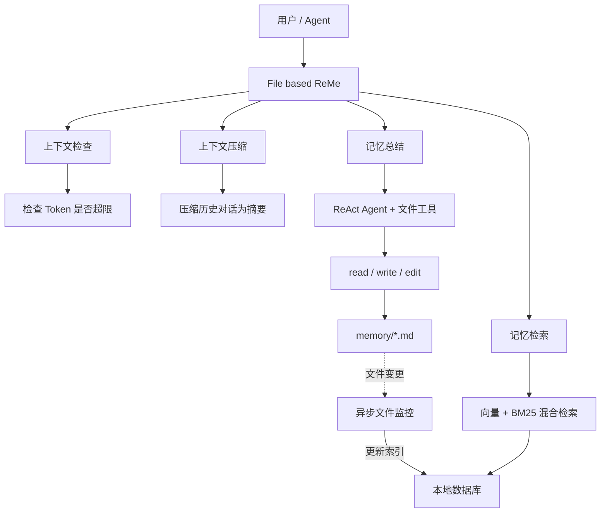
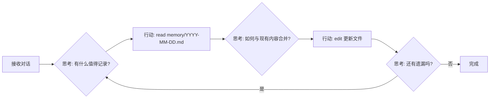
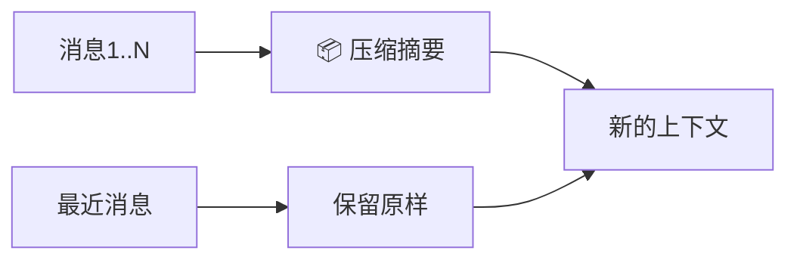
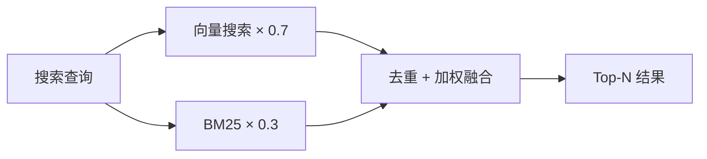
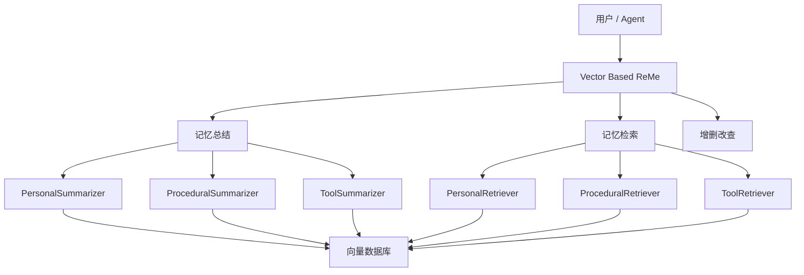

<p align="center">
 
</p>

<p align="center">
  <a href="https://pypi.org/project/reme-ai/"></a>
  <a href="https://pypi.org/project/reme-ai/"></a>
  <a href="https://pepy.tech/project/reme-ai/"></a>
  <a href="https://github.com/agentscope-ai/ReMe"></a>
</p>

<p align="center">
  <a href="./LICENSE"></a>
  <a href="./README.md"></a>
  <a href="./README_ZH.md"></a>
  <a href="https://github.com/agentscope-ai/ReMe"></a>
</p>

<p align="center">
  <strong>面向智能体的记忆管理工具包，Remember Me, Refine Me.</strong><br>
</p>

> 老版本请参阅 [0.2.x 版本文档](docs/README_0_2_x_ZH.md)

---

🧠 ReMe 是一个专为 **AI 智能体** 打造的记忆管理框架，同时提供基于文件系统和基于向量库的记忆系统。

它解决智能体记忆的两类核心问题：**上下文窗口有限**（长对话时早期信息被截断或丢失）、**会话无状态**（新对话无法继承历史，每次从零开始）。

ReMe 让智能体拥有**真正的记忆力**——旧对话自动浓缩，重要信息持久保存，下次对话自动想起来。


---

## 📁 基于文件的 ReMe

> 记忆即文件，文件即记忆

将**记忆视为文件**——可读、可编辑、可复制。

| 传统记忆系统    | File Based ReMe |
|-----------|-----------------|
| 🗄️ 数据库存储 | 📝 Markdown 文件  |
| 🔒 不可见    | 👀 随时可读         |
| ❌ 难修改     | ✏️ 直接编辑         |
| 🚫 难迁移    | 📦 复制即迁移        |

```
.reme/
├── MEMORY.md          # 长期记忆：用户偏好、项目配置等不常变的信息
└── memory/
    └── YYYY-MM-DD.md  # 每日日志：当天的工作记录，压缩时自动写入
```

### 核心能力

[ReMe File Based](reme/reme_fb.py) 是基于文件的记忆系统的核心类，就像一个**智能秘书**，帮你管理所有记忆相关的事务：

| 方法              | 功能           | 关键组件                                                                                                                                                                                                                             |
|-----------------|--------------|----------------------------------------------------------------------------------------------------------------------------------------------------------------------------------------------------------------------------------|
| `start`         | 🚀 启动记忆系统    | [BaseFileStore](reme/core/file_store/base_file_store.py)（本地文件store）<br/>[BaseFileWatcher](reme/core/file_watcher/base_file_watcher.py)（文件监控）<br/>[BaseEmbeddingModel](reme/core/embedding/base_embedding_model.py)（Embedding 缓存） |
| `close`         | 📕 关闭并保存     | 关闭文件store、停止文件监控、保存 Embedding 缓存                                                                                                                                                                                                 |
| `context_check` | 📏 检查上下文是否超限 | [ContextChecker](reme/memory/file_based/fb_context_checker.py)                                                                                                                                                                   |
| `compact`       | 📦 压缩历史对话为摘要 | [Compactor](reme/memory/file_based/fb_compactor.py)                                                                                                                                                                              |
| `summary`       | 📝 将重要记忆写入文件 | [Summarizer](reme/memory/file_based/fb_summarizer.py)                                                                                                                                                                            |
| `memory_search` | 🔍 语义搜索记忆    | [MemorySearch](reme/memory/tools/chunk/memory_search.py)                                                                                                                                                                         |
| `memory_get`    | 📖 读取指定记忆文件  | [MemoryGet](reme/memory/tools/chunk/memory_get.py)                                                                                                                                                                               |

## 🗃️ 基于向量库的 ReMe

[ReMe Vector Based](reme/reme.py) 是基于向量库的记忆系统核心类，支持三种记忆类型的统一管理：

| 记忆类型         | 用途               | 使用场景        |
|--------------|------------------|-------------|
| **个人记忆**     | 记录用户偏好、习惯        | `user_name` |
| **任务/程序性记忆** | 记录任务执行经验、成功/失败模式 | `task_name` |
| **工具记忆**     | 记录工具使用经验、参数优化    | `tool_name` |

### 核心能力

| 方法                 | 功能       | 说明             |
|--------------------|----------|----------------|
| `summarize_memory` | 🧠 记忆总结  | 从对话中自动提取并存储记忆  |
| `retrieve_memory`  | 🔍 记忆检索  | 根据查询检索相关记忆     |
| `add_memory`       | ➕ 添加记忆   | 手动添加记忆到向量库     |
| `get_memory`       | 📖 获取记忆  | 通过 ID 获取单条记忆   |
| `update_memory`    | ✏️ 更新记忆  | 更新已有记忆的内容或元数据  |
| `delete_memory`    | 🗑️ 删除记忆 | 删除指定记忆         |
| `list_memory`      | 📋 列出记忆  | 列出某类记忆，支持过滤和排序 |

---

## 💻 ReMeCli：基于文件记忆的终端助手

<table border="0" cellspacing="0" cellpadding="0" style="border: none;">
  <tr style="border: none;">
    <td width="10%" style="border: none; vertical-align: middle; text-align: center;">
      <strong>马<br>上<br>有<br>钱</strong>
    </td>
    <td width="80%" style="border: none;">
      <video src="https://github.com/user-attachments/assets/befa7e40-63ba-4db2-8251-516024616e00" autoplay muted loop controls></video>
    </td>
    <td width="10%" style="border: none; vertical-align: middle; text-align: center;">
      <strong>马<br>到<br>成<br>功</strong>
    </td>
  </tr>
</table>

### 什么时候会写记忆？

| 场景               | 写到哪                    | 怎么触发                 |
|------------------|------------------------|----------------------|
| 上下文超长自动压缩        | `memory/YYYY-MM-DD.md` | 后台自动                 |
| 用户执行 `/compact`  | `memory/YYYY-MM-DD.md` | 手动压缩 + 后台保存          |
| 用户执行 `/new`      | `memory/YYYY-MM-DD.md` | 新对话 + 后台保存           |
| 用户说"记住这个"        | `MEMORY.md` 或日志        | Agent 用 `write` 工具写入 |
| Agent 发现了重要决策/偏好 | `MEMORY.md`            | Agent 主动写            |

### 记忆检索工具

| 方式   | 工具              | 什么时候用      | 举例                       |
|------|-----------------|------------|--------------------------|
| 语义搜索 | `memory_search` | 不确定记在哪，模糊找 | "之前关于部署的讨论"              |
| 直接读  | `read`          | 知道是哪天、哪个文件 | 读 `memory/2025-02-13.md` |

搜索用的是**向量 + BM25 混合检索**（向量权重 0.7，BM25 权重 0.3），无论自然语言还是精确关键词都能命中。

### 内置工具

| 工具              | 功能       | 细节                                     |
|-----------------|----------|----------------------------------------|
| `memory_search` | 搜记忆      | MEMORY.md 和 memory/*.md 里做向量+BM25 混合检索 |
| `bash`          | 跑命令      | 执行 bash 命令，有超时和输出截断                    |
| `ls`            | 看目录      | 列目录结构                                  |
| `read`          | 读文件      | 文本和图片都行，支持分段读                          |
| `edit`          | 改文件      | 精确匹配文本后替换                              |
| `write`         | 写文件      | 创建或覆盖，自动建目录                            |
| `execute_code`  | 跑 Python | 运行代码片段                                 |
| `web_search`    | 联网搜索     | 通过 Tavily                              |

---

## 🚀 快速开始

### 安装

```bash
pip install -U reme-ai
```

### 环境变量

API 密钥通过环境变量设置，可写在项目根目录的 `.env` 文件中：

| 环境变量                      | 说明                    | 示例                                                  |
|---------------------------|-----------------------|-----------------------------------------------------|
| `REME_LLM_API_KEY`        | LLM 的 API Key         | `sk-xxx`                                            |
| `REME_LLM_BASE_URL`       | LLM 的 Base URL        | `https://dashscope.aliyuncs.com/compatible-mode/v1` |
| `REME_EMBEDDING_API_KEY`  | Embedding 的 API Key   | `sk-xxx`                                            |
| `REME_EMBEDDING_BASE_URL` | Embedding 的 Base URL  | `https://dashscope.aliyuncs.com/compatible-mode/v1` |
| `TAVILY_API_KEY`          | Tavily 搜索 API Key（可选） | `tvly-xxx`                                          |

### 使用 ReMeCli

#### 启动 ReMeCli

```bash
remecli config=cli
```

#### ReMeCli 系统命令

> 马年彩蛋：`/horse` 触发——烟花、奔马动画和随机马年祝福。

对话里输入 `/` 开头的命令控制状态：

| 命令         | 说明                  | 需等待响应 |
|------------|---------------------|-------|
| `/compact` | 手动压缩当前对话，同时后台存到长期记忆 | 是     |
| `/new`     | 开始新对话，历史后台保存到长期记忆   | 否     |
| `/clear`   | 清空一切，**不保存**        | 否     |
| `/history` | 看当前对话里未压缩的消息        | 否     |
| `/help`    | 看命令列表               | 否     |
| `/exit`    | 退出                  | 否     |

**三个命令的区别**

| 命令         | 压缩摘要  | 长期记忆 | 消息历史  |
|------------|-------|------|-------|
| `/compact` | 生成新摘要 | 保存   | 保留最近的 |
| `/new`     | 清空    | 保存   | 清空    |
| `/clear`   | 清空    | 不保存  | 清空    |

> `/clear` 是真删，删了就没了，不会存到任何地方。

### 使用 ReMe Package

#### 基于文件的 ReMe

```python
import asyncio

from reme import ReMeFb


async def main():
    # 初始化并启动
    reme = ReMeFb(
        default_llm_config={
            "backend": "openai",  # 后端类型，支持 openai 兼容接口
            "model_name": "qwen3.5-plus",  # 模型名称
        },
        default_file_store_config={
            "backend": "chroma",  # 存储后端，支持 sqlite/chroma/local
            "fts_enabled": True,  # 是否启用全文搜索
            "vector_enabled": False,  # 是否启用向量搜索（无 embedding 服务可设为 False）
        },
        context_window_tokens=128000,  # 模型上下文窗口大小（tokens）
        reserve_tokens=36000,  # 预留给输出的 token 数量
        keep_recent_tokens=20000,  # 保留最近消息的 token 数量
        vector_weight=0.7,  # 向量搜索权重（0-1），用于混合搜索
        candidate_multiplier=3.0,  # 候选结果倍数，用于召回更多候选项
    )
    await reme.start()

    messages = [
        {"role": "user", "content": "我喜欢用 Python 3.12"},
        {"role": "assistant", "content": "好的，已记录你偏好 Python 3.12"},
    ]

    # 检查上下文是否超限
    result = await reme.context_check(messages)
    print(f"压缩结论: {result}")

    # 压缩对话为摘要
    summary = await reme.compact(messages_to_summarize=messages)
    print(f"摘要: {summary}")

    # 将重要记忆写入文件（ReAct Agent 自动操作）
    await reme.summary(messages=messages, date="2026-02-28")

    # 语义搜索记忆
    results = await reme.memory_search(query="Python 版本偏好", max_results=5)
    print(f"搜索结果: {results}")

    # 读取指定记忆文件
    content = await reme.memory_get(path="MEMORY.md")
    print(f"记忆内容: {content}")

    # 关闭（保存 Embedding 缓存、停止文件监控）
    await reme.close()


if __name__ == "__main__":
    asyncio.run(main())
```

#### 基于向量库的 ReMe

```python
import asyncio
from reme import ReMe


async def main():
    # 初始化 ReMe
    reme = ReMe(
        working_dir=".reme",
        default_llm_config={
            "backend": "openai",
            "model_name": "qwen3-30b-a3b-thinking-2507",
        },
        default_embedding_model_config={
            "backend": "openai",
            "model_name": "text-embedding-v4",
            "dimensions": 1024,
        },
        default_vector_store_config={
            "backend": "local",  # 支持 local/chroma/qdrant/elasticsearch
        },
    )
    await reme.start()

    messages = [
        {"role": "user", "content": "帮我写一个 Python 脚本", "time_created": "2026-02-28 10:00:00"},
        {"role": "assistant", "content": "好的，我来帮你写", "time_created": "2026-02-28 10:00:05"},
    ]

    # 1. 从对话中总结记忆（自动提取用户偏好、任务经验等）
    result = await reme.summarize_memory(
        messages=messages,
        user_name="alice",  # 个人记忆
        task_name="code_writing",  # 任务记忆
    )
    print(f"总结结果: {result}")

    # 2. 检索相关记忆
    memories = await reme.retrieve_memory(
        query="Python 编程",
        user_name="alice",
        task_name="code_writing",
    )
    print(f"检索结果: {memories}")

    # 3. 手动添加记忆
    memory_node = await reme.add_memory(
        memory_content="用户喜欢简洁的代码风格",
        user_name="alice",
        when_to_use="当为用户编写代码时",
    )
    print(f"添加的记忆: {memory_node}")
    memory_id = memory_node.memory_id

    # 4. 通过 ID 获取单条记忆
    fetched_memory = await reme.get_memory(memory_id=memory_id)
    print(f"获取的记忆: {fetched_memory}")

    # 5. 更新记忆内容
    updated_memory = await reme.update_memory(
        memory_id=memory_id,
        user_name="alice",
        memory_content="用户喜欢简洁且带注释的代码风格",
        when_to_use="当为用户编写或审查代码时",
    )
    print(f"更新后的记忆: {updated_memory}")

    # 6. 列出用户的所有记忆（支持过滤和排序）
    all_memories = await reme.list_memory(
        user_name="alice",
        limit=10,
        sort_key="time_created",
        reverse=True,
    )
    print(f"用户记忆列表: {all_memories}")

    # 7. 删除指定记忆
    await reme.delete_memory(memory_id=memory_id)
    print(f"已删除记忆: {memory_id}")

    # 8. 删除所有记忆（谨慎使用）
    # await reme.delete_all()

    await reme.close()


if __name__ == "__main__":
    asyncio.run(main())
```

## 🏛️ 技术架构

### 基于文件的 ReMe 核心架构



#### 记忆总结：ReAct + 文件工具

[Summarizer](reme/memory/file_based/fb_summarizer.py) 是记忆总结的核心组件，它采用 **ReAct + 文件工具** 模式。



#### 文件工具集

Summarizer 配备了一套文件操作工具，让 AI 能够直接操作记忆文件：

| 工具      | 功能     | 使用场景         |
|---------|--------|--------------|
| `read`  | 读取文件内容 | 查看现有记忆，避免重复  |
| `write` | 覆盖写入文件 | 创建新记忆文件或大幅重构 |
| `edit`  | 编辑文件局部 | 追加新内容或修改特定部分 |

#### 上下文压缩

当对话过长时，[Compactor](reme/memory/file_based/fb_compactor.py) 负责将历史对话压缩为精华摘要——就像写**会议纪要**
，把冗长的讨论浓缩成关键要点。



压缩摘要包含继续工作所需的关键信息：

| 内容     | 说明            |
|--------|---------------|
| 🎯 目标  | 用户想要完成什么      |
| ⚙️ 约束  | 用户提到的要求和偏好    |
| 📈 进展  | 已完成/进行中/阻塞的任务 |
| 🔑 决策  | 做出的决策及原因      |
| 📌 上下文 | 文件路径、函数名等关键数据 |

#### 记忆检索

[MemorySearch](reme/memory/tools/chunk/memory_search.py) 提供**向量 + BM25 混合检索**能力，两种方式优势互补：

| 检索方式        | 优势              | 劣势             |
|-------------|-----------------|----------------|
| **向量语义**    | 捕捉意义相近但措辞不同的内容  | 对精确 token 匹配较弱 |
| **BM25 全文** | 精确 token 命中效果极佳 | 无法理解同义词和改写     |

**融合机制**：同时使用两路召回，按权重加权求和（向量 0.7 + BM25 0.3），确保无论是「自然语言提问」还是「精确查找」都能获得可靠结果。



---

### 基于向量库的 ReMe 核心架构



## ⭐ 社区与支持

- **Star 与 Watch**：Star 可让更多智能体开发者发现 ReMe；Watch 可助你第一时间获知新版本与特性。
- **分享你的成果**：在 Issue 或 Discussion 中分享 ReMe 为你的智能体解锁了什么——我们非常乐意展示社区的优秀案例。
- **需要新功能？** 提交 Feature Request，我们将与社区一起完善。
- **代码贡献**：欢迎任何形式的代码贡献，请参阅 [贡献指南](docs/contribution.md)。
- **致谢**：感谢 OpenClaw、Mem0、MemU、CoPaw 等优秀的开源项目，为项目带来诸多启发与帮助。

---

## 📄 引用

```bibtex
@software{AgentscopeReMe2025,
  title = {AgentscopeReMe: Memory Management Kit for Agents},
  author = {ReMe Team},
  url = {https://reme.agentscope.io},
  year = {2025}
}
```

---

## ⚖️ 许可证

本项目基于 Apache License 2.0 开源，详情参见 [LICENSE](./LICENSE) 文件。

---

## 📈 Star 历史

[](https://www.star-history.com/#agentscope-ai/ReMe&Date)
