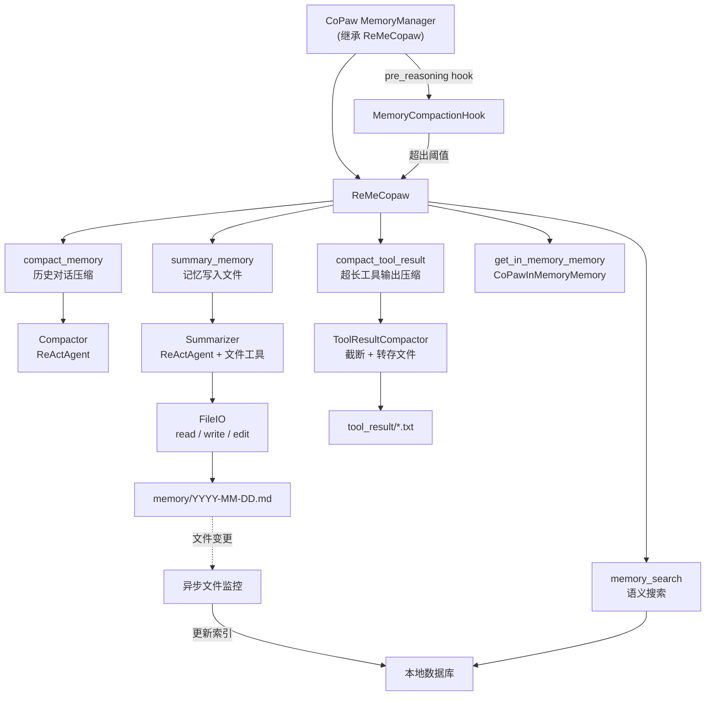
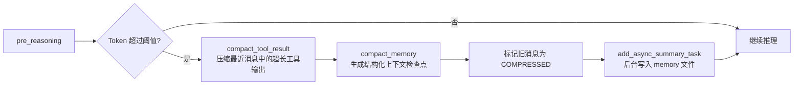
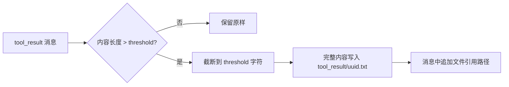
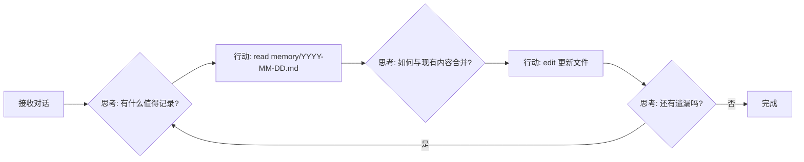
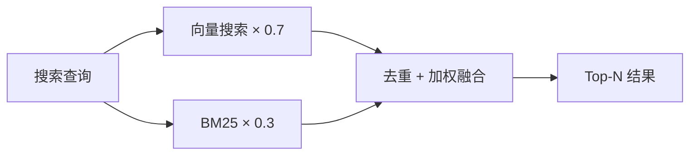
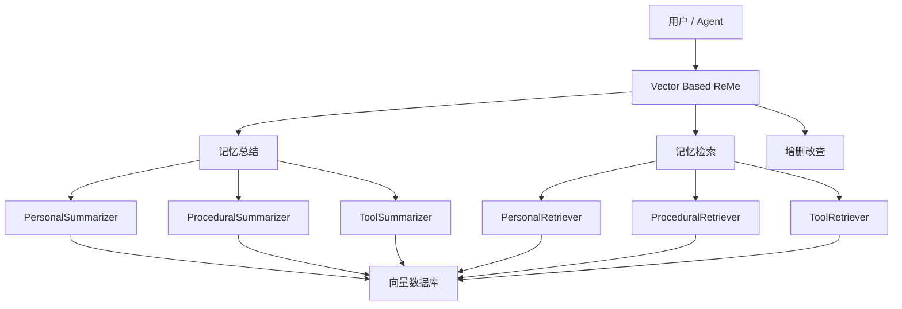

<p align="center">
 
</p>

<p align="center">
  <a href="https://pypi.org/project/reme-ai/"></a>
  <a href="https://pypi.org/project/reme-ai/"></a>
  <a href="https://pepy.tech/project/reme-ai/"></a>
  <a href="https://github.com/agentscope-ai/ReMe"></a>
</p>

<p align="center">
  <a href="./LICENSE"></a>
  <a href="./README.md"></a>
  <a href="./README_ZH.md"></a>
  <a href="https://github.com/agentscope-ai/ReMe"></a>
</p>

<p align="center">
  <strong>面向智能体的记忆管理工具包，Remember Me, Refine Me.</strong><br>
</p>

> 老版本请参阅 [0.2.x 版本文档](docs/README_0_2_x_ZH.md)

---

🧠 ReMe 是一个专为 **AI 智能体** 打造的记忆管理框架，同时提供基于文件系统和基于向量库的记忆系统。

它解决智能体记忆的两类核心问题：**上下文窗口有限**（长对话时早期信息被截断或丢失）、**会话无状态**（新对话无法继承历史，每次从零开始）。

ReMe 让智能体拥有**真正的记忆力**——旧对话自动浓缩，重要信息持久保存，下次对话自动想起来。


---

## 📁 基于文件的 CoPaw 记忆系统

> 记忆即文件，文件即记忆

将**记忆视为文件**——可读、可编辑、可复制。[CoPaw](https://github.com/agentscope-ai/CoPaw)
通过 [MemoryManager](https://github.com/agentscope-ai/CoPaw/blob/main/src/copaw/agents/memory/memory_manager.py)
集成此记忆系统，继承 `ReMeCopaw` 并对外暴露记忆管理能力。

| 传统记忆系统    | File Based ReMe |
|-----------|-----------------|
| 🗄️ 数据库存储 | 📝 Markdown 文件  |
| 🔒 不可见    | 👀 随时可读         |
| ❌ 难修改     | ✏️ 直接编辑         |
| 🚫 难迁移    | 📦 复制即迁移        |

```
working_dir/
├── MEMORY.md              # 长期记忆：用户偏好、项目配置等持久信息
├── memory/
│   └── YYYY-MM-DD.md      # 每日摘要日志：对话结束后自动写入
└── tool_result/           # 超长工具输出缓存（自动管理，超期自动清理）
    └── <uuid>.txt
```

### 核心能力

[ReMeCopaw](reme/reme_copaw.py) 是该记忆系统的核心类，为 AI Agent 提供完整的记忆管理能力：

| 方法                       | 功能           | 关键组件                                                                                                           |
|--------------------------|--------------|----------------------------------------------------------------------------------------------------------------|
| `start`                  | 🚀 启动记忆系统    | 初始化文件存储、文件监控、Embedding 缓存；清理过期工具结果文件                                                                           |
| `close`                  | 📕 关闭并清理     | 清理工具结果文件、停止文件监控、保存 Embedding 缓存                                                                                |
| `compact_memory`         | 📦 压缩历史对话为摘要 | [Compactor](reme/memory/file_based_copaw/compactor.py) — ReActAgent 生成结构化上下文检查点                                |
| `summary_memory`         | 📝 将重要记忆写入文件 | [Summarizer](reme/memory/file_based_copaw/summarizer.py) — ReActAgent + 文件工具（read / write / edit）              |
| `compact_tool_result`    | ✂️ 压缩超长工具输出  | [ToolResultCompactor](reme/memory/file_based_copaw/tool_result_compactor.py) — 截断并转存到 `tool_result/`，消息中保留文件引用 |
| `add_async_summary_task` | ⚡ 提交后台摘要任务   | `asyncio.create_task`，摘要不阻塞主对话流程                                                                               |
| `await_summary_tasks`    | ⏳ 等待后台任务完成   | 收集所有后台摘要任务的结果，关闭前调用确保写入完成                                                                                      |
| `memory_search`          | 🔍 语义搜索记忆    | [MemorySearch](reme/memory/tools/chunk/memory_search.py) — 向量 + BM25 混合检索                                      |
| `get_in_memory_memory`   | 🗂️ 创建会话内存实例 | [CoPawInMemoryMemory](reme/memory/file_based_copaw/copaw_in_memory_memory.py) — Token 感知的内存管理，支持压缩摘要和状态序列化     |
| `update_params`          | ⚙️ 动态更新运行时参数 | 运行时调整 `max_input_length`、`memory_compact_ratio`、`language`                                                     |

## 🗃️ 基于向量库的 ReMe

[ReMe Vector Based](reme/reme.py) 是基于向量库的记忆系统核心类，支持三种记忆类型的统一管理：

| 记忆类型         | 用途               | 使用场景        |
|--------------|------------------|-------------|
| **个人记忆**     | 记录用户偏好、习惯        | `user_name` |
| **任务/程序性记忆** | 记录任务执行经验、成功/失败模式 | `task_name` |
| **工具记忆**     | 记录工具使用经验、参数优化    | `tool_name` |

### 核心能力

| 方法                 | 功能       | 说明             |
|--------------------|----------|----------------|
| `summarize_memory` | 🧠 记忆总结  | 从对话中自动提取并存储记忆  |
| `retrieve_memory`  | 🔍 记忆检索  | 根据查询检索相关记忆     |
| `add_memory`       | ➕ 添加记忆   | 手动添加记忆到向量库     |
| `get_memory`       | 📖 获取记忆  | 通过 ID 获取单条记忆   |
| `update_memory`    | ✏️ 更新记忆  | 更新已有记忆的内容或元数据  |
| `delete_memory`    | 🗑️ 删除记忆 | 删除指定记忆         |
| `list_memory`      | 📋 列出记忆  | 列出某类记忆，支持过滤和排序 |

---

## 💻 ReMeCli：基于文件记忆的终端助手

<table border="0" cellspacing="0" cellpadding="0" style="border: none;">
  <tr style="border: none;">
    <td width="10%" style="border: none; vertical-align: middle; text-align: center;">
      <strong>马<br>上<br>有<br>钱</strong>
    </td>
    <td width="80%" style="border: none;">
      <video src="https://github.com/user-attachments/assets/befa7e40-63ba-4db2-8251-516024616e00" autoplay muted loop controls></video>
    </td>
    <td width="10%" style="border: none; vertical-align: middle; text-align: center;">
      <strong>马<br>到<br>成<br>功</strong>
    </td>
  </tr>
</table>

### 什么时候会写记忆？

| 场景               | 写到哪                    | 怎么触发                 |
|------------------|------------------------|----------------------|
| 上下文超长自动压缩        | `memory/YYYY-MM-DD.md` | 后台自动                 |
| 用户执行 `/compact`  | `memory/YYYY-MM-DD.md` | 手动压缩 + 后台保存          |
| 用户执行 `/new`      | `memory/YYYY-MM-DD.md` | 新对话 + 后台保存           |
| 用户说"记住这个"        | `MEMORY.md` 或日志        | Agent 用 `write` 工具写入 |
| Agent 发现了重要决策/偏好 | `MEMORY.md`            | Agent 主动写            |

### 记忆检索工具

| 方式   | 工具              | 什么时候用      | 举例                       |
|------|-----------------|------------|--------------------------|
| 语义搜索 | `memory_search` | 不确定记在哪，模糊找 | "之前关于部署的讨论"              |
| 直接读  | `read`          | 知道是哪天、哪个文件 | 读 `memory/2025-02-13.md` |

搜索用的是**向量 + BM25 混合检索**（向量权重 0.7，BM25 权重 0.3），无论自然语言还是精确关键词都能命中。

### 内置工具

| 工具              | 功能       | 细节                                     |
|-----------------|----------|----------------------------------------|
| `memory_search` | 搜记忆      | MEMORY.md 和 memory/*.md 里做向量+BM25 混合检索 |
| `bash`          | 跑命令      | 执行 bash 命令，有超时和输出截断                    |
| `ls`            | 看目录      | 列目录结构                                  |
| `read`          | 读文件      | 文本和图片都行，支持分段读                          |
| `edit`          | 改文件      | 精确匹配文本后替换                              |
| `write`         | 写文件      | 创建或覆盖，自动建目录                            |
| `execute_code`  | 跑 Python | 运行代码片段                                 |
| `web_search`    | 联网搜索     | 通过 Tavily                              |

---

## 🚀 快速开始

### 安装

```bash
pip install -U reme-ai
```

### 环境变量

API 密钥通过环境变量设置，可写在项目根目录的 `.env` 文件中：

| 环境变量                      | 说明                    | 示例                                                  |
|---------------------------|-----------------------|-----------------------------------------------------|
| `REME_LLM_API_KEY`        | LLM 的 API Key         | `sk-xxx`                                            |
| `REME_LLM_BASE_URL`       | LLM 的 Base URL        | `https://dashscope.aliyuncs.com/compatible-mode/v1` |
| `REME_EMBEDDING_API_KEY`  | Embedding 的 API Key   | `sk-xxx`                                            |
| `REME_EMBEDDING_BASE_URL` | Embedding 的 Base URL  | `https://dashscope.aliyuncs.com/compatible-mode/v1` |
| `TAVILY_API_KEY`          | Tavily 搜索 API Key（可选） | `tvly-xxx`                                          |

### 使用 ReMeCli

#### 启动 ReMeCli

```bash
remecli config=cli
```

#### ReMeCli 系统命令

> 马年彩蛋：`/horse` 触发——烟花、奔马动画和随机马年祝福。

对话里输入 `/` 开头的命令控制状态：

| 命令         | 说明                  | 需等待响应 |
|------------|---------------------|-------|
| `/compact` | 手动压缩当前对话，同时后台存到长期记忆 | 是     |
| `/new`     | 开始新对话，历史后台保存到长期记忆   | 否     |
| `/clear`   | 清空一切，**不保存**        | 否     |
| `/history` | 看当前对话里未压缩的消息        | 否     |
| `/help`    | 看命令列表               | 否     |
| `/exit`    | 退出                  | 否     |

**三个命令的区别**

| 命令         | 压缩摘要  | 长期记忆 | 消息历史  |
|------------|-------|------|-------|
| `/compact` | 生成新摘要 | 保存   | 保留最近的 |
| `/new`     | 清空    | 保存   | 清空    |
| `/clear`   | 清空    | 不保存  | 清空    |

> `/clear` 是真删，删了就没了，不会存到任何地方。

### 使用 ReMe Package

#### 基于文件的 ReMe（CoPaw的记忆系统）

`ReMeCopaw` 接收 AgentScope 的 `ChatModelBase`、`Formatter`、`Toolkit` 等组件，通过环境变量配置 Embedding 和存储后端：

| 环境变量                       | 说明                                | 默认值                                                 |
|----------------------------|-----------------------------------|-----------------------------------------------------|
| `EMBEDDING_API_KEY`        | Embedding 服务 API Key              | `""`（未配置则禁用向量搜索）                                    |
| `EMBEDDING_BASE_URL`       | Embedding 服务 Base URL             | `https://dashscope.aliyuncs.com/compatible-mode/v1` |
| `EMBEDDING_MODEL_NAME`     | Embedding 模型名称                    | `""`                                                |
| `EMBEDDING_DIMENSIONS`     | 向量维度                              | `1024`                                              |
| `EMBEDDING_CACHE_ENABLED`  | 是否启用 Embedding 缓存                 | `true`                                              |
| `EMBEDDING_MAX_CACHE_SIZE` | 最大缓存条数                            | `2000`                                              |
| `FTS_ENABLED`              | 是否启用全文搜索（BM25）                    | `true`                                              |
| `MEMORY_STORE_BACKEND`     | 存储后端（`auto` / `chroma` / `local`） | `auto`（Windows 用 local，其他用 chroma）                  |

```python
import asyncio

from agentscope.formatter import ClaudeFormatter
from agentscope.model import get_model
from agentscope.token import HuggingFaceTokenCounter
from agentscope.tool import Toolkit

from reme.reme_copaw import ReMeCopaw


async def main():
    # 准备 AgentScope 核心组件
    chat_model = get_model(config={"backend": "openai", "model_name": "qwen3.5-plus"})
    formatter = ClaudeFormatter()
    token_counter = HuggingFaceTokenCounter()
    toolkit = Toolkit()  # 可注册额外工具

    # 初始化 ReMeCopaw
    reme = ReMeCopaw(
        working_dir=".reme",  # 记忆文件存储目录
        chat_model=chat_model,
        formatter=formatter,
        token_counter=token_counter,
        toolkit=toolkit,
        max_input_length=128000,  # 模型上下文窗口（tokens）
        memory_compact_ratio=0.7,  # 达到 max_input_length * 0.7 时触发压缩
        language="zh",  # 摘要语言（zh / ""）
        tool_result_threshold=1000,  # 超过此字符数的工具输出自动转存
        retention_days=7,  # tool_result/ 文件保留天数
    )
    await reme.start()

    messages = [...]  # list[Msg]，对话历史

    # 1. 压缩超长工具输出（防止工具结果撑爆上下文）
    messages = await reme.compact_tool_result(messages)

    # 2. 将历史对话压缩为结构化摘要（触发时机：上下文接近上限）
    summary = await reme.compact_memory(
        messages=messages,
        previous_summary="",  # 可传入上轮摘要，实现增量更新
    )
    print(f"压缩摘要:\n{summary}")

    # 3. 后台异步提交摘要任务（不阻塞对话，摘要写入 memory/YYYY-MM-DD.md）
    reme.add_async_summary_task(messages=messages)

    # 4. 语义搜索记忆（向量 + BM25 混合检索）
    result = await reme.memory_search(query="Python 版本偏好", max_results=5)
    print(f"搜索结果: {result}")

    # 5. 获取会话内存实例（CoPawInMemoryMemory，管理单次对话的上下文）
    memory = reme.get_in_memory_memory()
    token_stats = await memory.estimate_tokens()
    print(f"当前上下文使用率: {token_stats['context_usage_ratio']:.1f}%")

    # 6. 关闭前等待后台任务完成
    await reme.await_summary_tasks()
    await reme.close()


if __name__ == "__main__":
    asyncio.run(main())
```

#### 基于向量库的 ReMe

```python
import asyncio
from reme import ReMe


async def main():
    # 初始化 ReMe
    reme = ReMe(
        working_dir=".reme",
        default_llm_config={
            "backend": "openai",
            "model_name": "qwen3.5-plus",
        },
        default_embedding_model_config={
            "backend": "openai",
            "model_name": "text-embedding-v4",
            "dimensions": 1024,
        },
        default_vector_store_config={
            "backend": "local",  # 支持 local/chroma/qdrant/elasticsearch
        },
    )
    await reme.start()

    messages = [
        {"role": "user", "content": "帮我写一个 Python 脚本", "time_created": "2026-02-28 10:00:00"},
        {"role": "assistant", "content": "好的，我来帮你写", "time_created": "2026-02-28 10:00:05"},
    ]

    # 1. 从对话中总结记忆（自动提取用户偏好、任务经验等）
    result = await reme.summarize_memory(
        messages=messages,
        user_name="alice",  # 个人记忆
        # task_name="code_writing",  # 任务记忆
    )
    print(f"总结结果: {result}")

    # 2. 检索相关记忆
    memories = await reme.retrieve_memory(
        query="Python 编程",
        user_name="alice",
        # task_name="code_writing",
    )
    print(f"检索结果: {memories}")

    # 3. 手动添加记忆
    memory_node = await reme.add_memory(
        memory_content="用户喜欢简洁的代码风格",
        user_name="alice",
    )
    print(f"添加的记忆: {memory_node}")
    memory_id = memory_node.memory_id

    # 4. 通过 ID 获取单条记忆
    fetched_memory = await reme.get_memory(memory_id=memory_id)
    print(f"获取的记忆: {fetched_memory}")

    # 5. 更新记忆内容
    updated_memory = await reme.update_memory(
        memory_id=memory_id,
        user_name="alice",
        memory_content="用户喜欢简洁且带注释的代码风格",
    )
    print(f"更新后的记忆: {updated_memory}")

    # 6. 列出用户的所有记忆（支持过滤和排序）
    all_memories = await reme.list_memory(
        user_name="alice",
        limit=10,
        sort_key="time_created",
        reverse=True,
    )
    print(f"用户记忆列表: {all_memories}")

    # 7. 删除指定记忆
    await reme.delete_memory(memory_id=memory_id)
    print(f"已删除记忆: {memory_id}")

    # 8. 删除所有记忆（谨慎使用）
    # await reme.delete_all()

    await reme.close()


if __name__ == "__main__":
    asyncio.run(main())
```

## 🏛️ 技术架构

### 基于文件的 CoPaw 记忆系统架构

[CoPaw MemoryManager](https://github.com/agentscope-ai/CoPaw/blob/main/src/copaw/agents/memory/memory_manager.py) 继承
`ReMeCopaw`，将记忆能力集成到 Agent 推理流程中：


```mermaid
graph TB
    CoPaw["CoPaw MemoryManager\n(继承 ReMeCopaw)"] -->|pre_reasoning hook| Hook[MemoryCompactionHook]
    CoPaw --> ReMeCopaw[ReMeCopaw]
    Hook -->|超出阈值| ReMeCopaw
    ReMeCopaw --> CompactMemory[compact_memory\n历史对话压缩]
    ReMeCopaw --> SummaryMemory[summary_memory\n记忆写入文件]
    ReMeCopaw --> CompactToolResult[compact_tool_result\n超长工具输出压缩]
    ReMeCopaw --> MemSearch[memory_search\n语义搜索]
    ReMeCopaw --> InMemory[get_in_memory_memory\nCoPawInMemoryMemory]
    CompactMemory --> Compactor[Compactor\nReActAgent]
    SummaryMemory --> Summarizer[Summarizer\nReActAgent + 文件工具]
    CompactToolResult --> ToolResultCompactor[ToolResultCompactor\n截断 + 转存文件]
    Summarizer --> FileIO[FileIO\nread / write / edit]
    FileIO --> MemoryFiles[memory/YYYY-MM-DD.md]
    ToolResultCompactor --> ToolResultFiles[tool_result/*.txt]
    MemoryFiles -.->|文件变更| FileWatcher[异步文件监控]
    FileWatcher -->|更新索引| FileStore[本地数据库]
    MemSearch --> FileStore
```

#### 自动压缩触发流程

`MemoryCompactionHook` 在每次推理前检查上下文 Token 用量，超过阈值时自动触发压缩：


```mermaid
graph LR
    A[pre_reasoning] --> B{Token 超过阈值?}
    B -->|否| Z[继续推理]
    B -->|是| C[compact_tool_result\n压缩最近消息中的超长工具输出]
    C --> D[compact_memory\n生成结构化上下文检查点]
    D --> E[标记旧消息为 COMPRESSED]
    E --> F[add_async_summary_task\n后台写入 memory 文件]
    F --> Z
```

#### 上下文压缩摘要格式

[Compactor](reme/memory/file_based_copaw/compactor.py) 使用 ReActAgent 将历史对话压缩为结构化的**上下文检查点**：

| 字段                    | 说明                    |
|-----------------------|-----------------------|
| `## Goal`             | 🎯 用户要完成的目标（可多项）      |
| `## Constraints`      | ⚙️ 用户提到的约束和偏好         |
| `## Progress`         | 📈 已完成 / 进行中 / 阻塞的任务  |
| `## Key Decisions`    | 🔑 做出的决策及简短理由         |
| `## Next Steps`       | 🗺️ 下一步行动计划（有序列表）     |
| `## Critical Context` | 📌 文件路径、函数名、错误信息等关键数据 |

支持**增量更新**：传入 `previous_summary` 时，自动将新对话与旧摘要合并，保留历史进展。

#### 工具结果压缩

[ToolResultCompactor](reme/memory/file_based_copaw/tool_result_compactor.py) 解决工具输出过长导致上下文膨胀的问题：


```mermaid
graph LR
    A[tool_result 消息] --> B{内容长度 > threshold?}
    B -->|否| C[保留原样]
    B -->|是| D[截断到 threshold 字符]
    D --> E[完整内容写入 tool_result/uuid.txt]
    E --> F[消息中追加文件引用路径]
```

过期文件（超过 `retention_days`）在 `start` / `close` / `compact_tool_result` 时自动清理。

#### 记忆总结：ReAct + 文件工具

[Summarizer](reme/memory/file_based_copaw/summarizer.py) 采用 **ReAct + 文件工具** 模式，让 AI 自主决定写什么、写到哪：


```mermaid
graph LR
    A[接收对话] --> B{思考: 有什么值得记录?}
    B --> C[行动: read memory/YYYY-MM-DD.md]
    C --> D{思考: 如何与现有内容合并?}
    D --> E[行动: edit 更新文件]
    E --> F{思考: 还有遗漏吗?}
    F -->|是| B
    F -->|否| G[完成]
```

[FileIO](reme/memory/file_based_copaw/file_io.py) 提供文件操作工具集：

| 工具      | 功能            | 使用场景          |
|---------|---------------|---------------|
| `read`  | 读取文件内容（支持行范围） | 查看现有记忆，避免重复写入 |
| `write` | 覆盖写入文件        | 创建新记忆文件或大幅重构  |
| `edit`  | 精确匹配后替换       | 追加新内容或修改特定段落  |

#### 会话内存管理

[CoPawInMemoryMemory](reme/memory/file_based_copaw/copaw_in_memory_memory.py) 扩展了 AgentScope 的 `InMemoryMemory`：

| 功能                               | 说明                        |
|----------------------------------|---------------------------|
| `get_memory`                     | 按标记过滤消息，自动在头部追加压缩摘要       |
| `estimate_tokens`                | 精确估算当前上下文 Token 用量及使用率    |
| `get_history_str`                | 生成人类可读的对话历史摘要（含 Token 统计） |
| `state_dict` / `load_state_dict` | 支持状态序列化 / 反序列化（会话持久化）     |

#### 记忆检索

[MemorySearch](reme/memory/tools/chunk/memory_search.py) 提供**向量 + BM25 混合检索**能力：

| 检索方式        | 优势              | 劣势             |
|-------------|-----------------|----------------|
| **向量语义**    | 捕捉意义相近但措辞不同的内容  | 对精确 token 匹配较弱 |
| **BM25 全文** | 精确 token 命中效果极佳 | 无法理解同义词和改写     |

**融合机制**：两路召回后按权重加权求和（向量 0.7 + BM25 0.3），自然语言与精确查找均可命中。


```mermaid
graph LR
    Q[搜索查询] --> V[向量搜索 × 0.7]
Q --> B[BM25 × 0.3]
V --> M[去重 + 加权融合]
B --> M
M --> R[Top-N 结果]
```

---

### 基于向量库的 ReMe 核心架构


```mermaid
graph TB
    User[用户 / Agent] --> ReMe[Vector Based ReMe]
    ReMe --> Summarize[记忆总结]
    ReMe --> Retrieve[记忆检索]
    ReMe --> CRUD[增删改查]
    Summarize --> PersonalSum[PersonalSummarizer]
    Summarize --> ProceduralSum[ProceduralSummarizer]
    Summarize --> ToolSum[ToolSummarizer]
    Retrieve --> PersonalRet[PersonalRetriever]
    Retrieve --> ProceduralRet[ProceduralRetriever]
    Retrieve --> ToolRet[ToolRetriever]
    PersonalSum --> VectorStore[向量数据库]
    ProceduralSum --> VectorStore
    ToolSum --> VectorStore
    PersonalRet --> VectorStore
    ProceduralRet --> VectorStore
    ToolRet --> VectorStore
```

## ⭐ 社区与支持

- **Star 与 Watch**：Star 可让更多智能体开发者发现 ReMe；Watch 可助你第一时间获知新版本与特性。
- **分享你的成果**：在 Issue 或 Discussion 中分享 ReMe 为你的智能体解锁了什么——我们非常乐意展示社区的优秀案例。
- **需要新功能？** 提交 Feature Request，我们将与社区一起完善。
- **代码贡献**：欢迎任何形式的代码贡献，请参阅 [贡献指南](docs/contribution.md)。
- **致谢**：感谢 OpenClaw、Mem0、MemU、CoPaw 等优秀的开源项目，为项目带来诸多启发与帮助。

---

## 📄 引用

```bibtex
@software{AgentscopeReMe2025,
  title = {AgentscopeReMe: Memory Management Kit for Agents},
  author = {ReMe Team},
  url = {https://reme.agentscope.io},
  year = {2025}
}
```

---

## ⚖️ 许可证

本项目基于 Apache License 2.0 开源，详情参见 [LICENSE](./LICENSE) 文件。

---

## 📈 Star 历史

[](https://www.star-history.com/#agentscope-ai/ReMe&Date)
