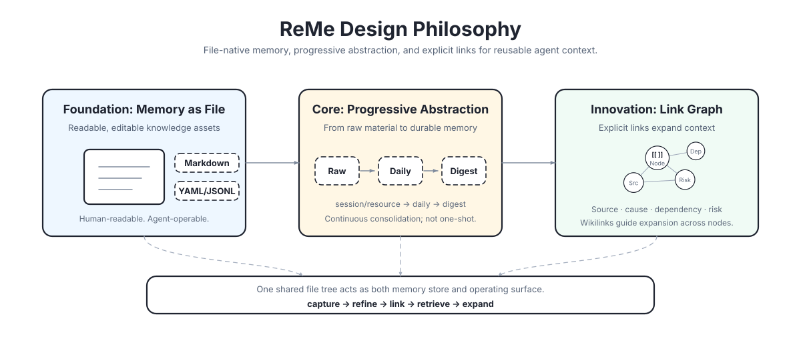
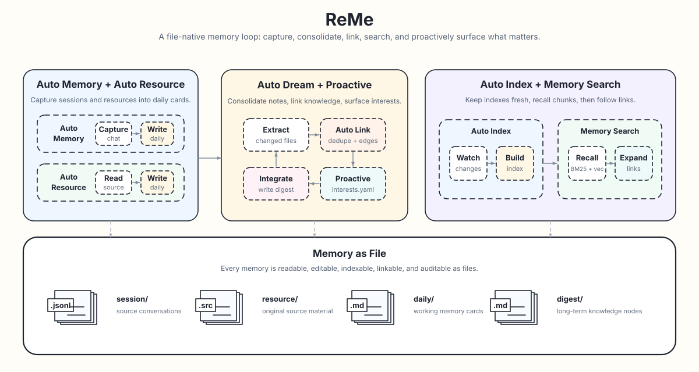
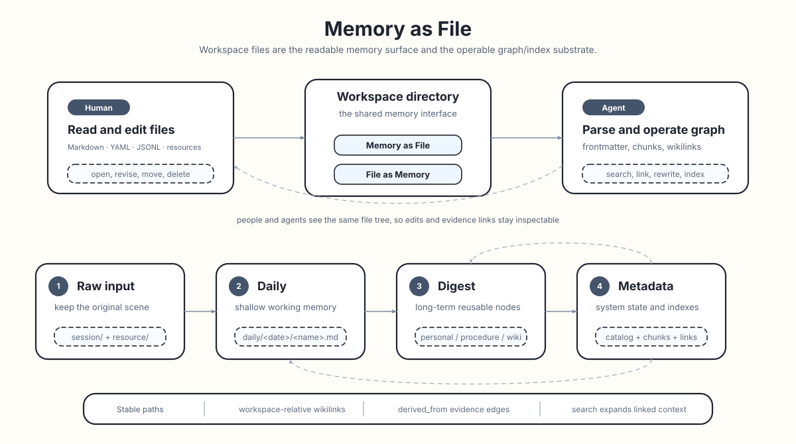
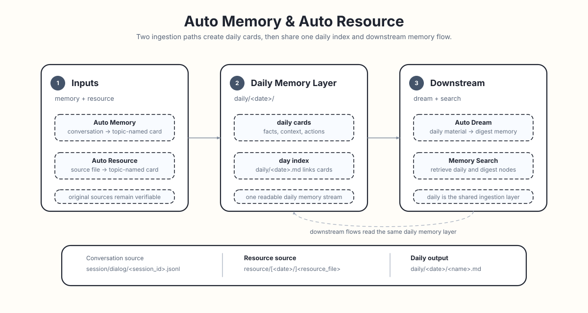
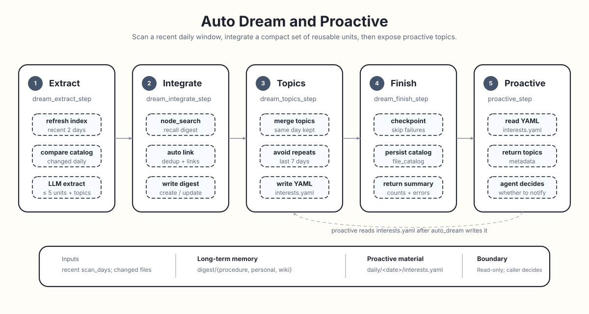
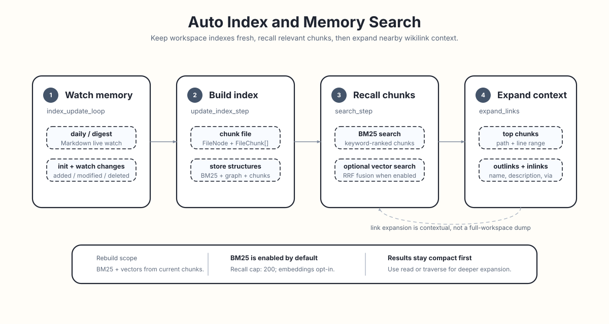
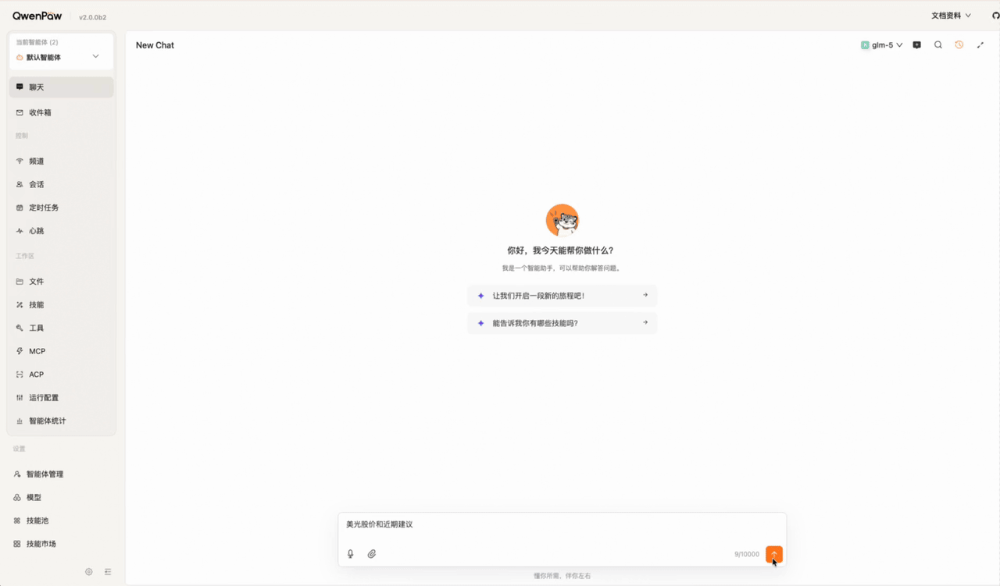
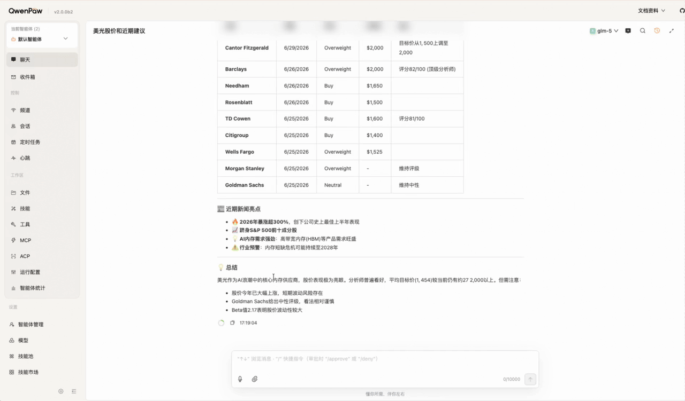
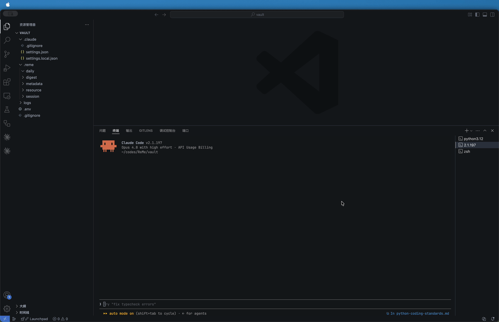
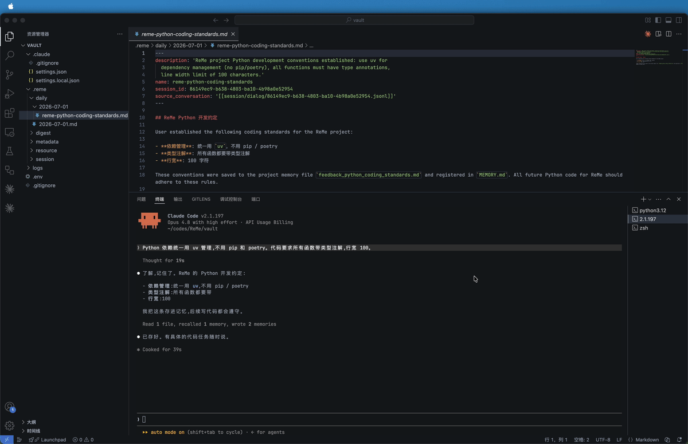

<p align="center">
 
</p>

<p align="center">
  <a href="https://pypi.org/project/reme-ai/"></a>
  <a href="https://pypi.org/project/reme-ai/"></a>
  <a href="https://pepy.tech/project/reme-ai/"></a>
  <a href="https://github.com/agentscope-ai/ReMe"></a>
  <a href="./LICENSE"></a>
  <a href="https://reme.agentscope.io"></a>
  <a href="./README.md"></a>
  <a href="./README_ZH.md"></a>
  <a href="https://github.com/agentscope-ai/ReMe"></a>
  <a href="https://deepwiki.com/agentscope-ai/ReMe"></a>
</p>

<p align="center">
<a href="https://trendshift.io/repositories/20528" target="_blank"></a>
</p>

<p align="center">
  <strong>面向 AI Agent 的 local-first 自进化个人知识库。</strong><br>
</p>

> 历史版本：[0.3.x](https://github.com/agentscope-ai/ReMe/tree/reme_v3) ·
> [0.2.x](https://github.com/agentscope-ai/ReMe/tree/v0.2.0.6) ·
> [MemoryScope](https://github.com/agentscope-ai/ReMe/tree/memoryscope_branch)

🧠 ReMe 将对话和资料持续沉淀为可读、可编辑、可检索、相互链接的 Markdown 记忆。它可以与 QwenPaw、OpenClaw、Hermes 和 Claude
Code 等 Agent 协作，在持续整理知识的同时，始终把文件控制权留给用户。

## ✨ 核心创新

- **Memory as File, File as Memory**：以带 frontmatter 和 wikilink 的 Markdown 作为记忆节点，用户和 Agent 都能直接查看、编辑、移动和备份。
- **自进化知识库**：Auto Memory、Auto Resource 和 Auto Dream 把对话与资料逐步加工为 daily 记忆和长期知识，Auto Link
  再将关系与来源写回文件。
- **渐进式混合搜索**：融合 wikilink、BM25 和可选 embedding，从关键词匹配、语义召回到关系扩展，避免一次性将所有邻居全文塞入上下文。
- **Agent 友好集成**：可通过 SKILL.md + CLI 读写和维护同一个本地 workspace，也支持 HTTP、MCP 和 Python API 接入。

<p align="center">
  
</p>

## 🔭 适用场景

- **Personal assistants**：为 [QwenPaw](https://github.com/agentscope-ai/QwenPaw)、
  [OpenClaw](https://github.com/openclaw/openclaw)、[Hermes](https://github.com/nousresearch/hermes-agent)
  等个人助理提供用户可编辑的长期记忆层。
- **Coding agents**：在接入 [Claude Code](integrations/claude_code/reme) 等 coding agent 时，跨会话保留代码风格、项目背景、仓库决策和流程经验。
- **LLM Wiki**：把对话、笔记和资料转化为可检索、可追溯、可链接的 Markdown 知识库，由用户和 Agent 共同维护。
- **Self-evolving agents**：帮助 Agent 从经验中学习，把成功路径、失败尝试、可复用流程和阶段性反思沉淀为记忆。

## 📰 新闻

- [2026.08] - 发布 [`@agentscope-ai/reme`](https://www.npmjs.com/package/@agentscope-ai/reme)，为 DeepSeek Harness
  提供原生 ReMe 记忆集成。
- [2026.08] - 发布 [ReMe 博客](https://agentscope-ai.github.io/ReMe/?doc=zh-reme-blog)，系统介绍本地优先的记忆架构、自进化工作流、混合检索、
  主动发现与评测结果。
- [2026.08] - 基于 ReMe 的智能体工具使用
  [经验驱动增强方法](https://reme.agentscope.io/?doc=toolmemory-zh)已发布，见
  [arXiv:2608.03403](https://arxiv.org/abs/2608.03403)。
- [2026.07] - 新增可选插件：[每日论文](https://reme.agentscope.io/?doc=daily-paper-zh)用于论文发现与解析，
  [Auto Fin](https://reme.agentscope.io/?doc=auto-fin-zh)用于研究最近 24 小时的主题相关财联社新闻，通过本地记忆搜索回顾历史材料并构建
  wikilink。
- [2026.07] -
  我们的论文 [Remember Me, Refine Me: A Dynamic Procedural Memory Framework for Experience-Driven Agent Evolution](https://aclanthology.org/2026.findings-acl.829/)
  已被 Findings of ACL 2026 接收。

## 🚀 快速开始

### 安装

ReMe 要求 Python 3.11+。

从 pip 安装：

```bash
pip install "reme-ai[core]"
```

从源码安装：

```bash
git clone https://github.com/agentscope-ai/ReMe.git
cd ReMe
pip install -e packages/reme_ai_studio -e ".[core]"
cd website
npm ci
npm run build:static
cd ..
```

静态构建要求 Node.js 22.13 或更高版本，并让源码安装可以直接使用 Studio。

### DeepSeek Harness 集成

启动 ReMe 服务后，将 npm 包安装到 DeepSeek Harness 的 Web profile：

```bash
dsh plugin --profile web add @agentscope-ai/reme
```

插件会在 Agent step 前检索相关 ReMe 记忆，并将主 Agent 已完成的对话提交给自动记忆任务。配置方法见
[TypeScript 集成指南](packages/typescript/README_ZH.md#deepseek-harness)。

### 环境变量

如果需要 LLM 驱动的记忆演化或 embedding 检索，可以配置环境变量。embedding 默认关闭，因此默认配置不会启动 embedding 模型，也不需要
embedding API key。

```bash
cat > .env <<'EOF'
# 可选：仅在配置中显式启用 embedding 组件后使用。
# EMBEDDING_API_KEY=sk-xxx
# EMBEDDING_BASE_URL=https://dashscope.aliyuncs.com/compatible-mode/v1

# 必须：auto_memory、auto_resource 和 auto_dream 需要 LLM。
LLM_API_KEY=sk-xxx
LLM_BASE_URL=https://dashscope.aliyuncs.com/compatible-mode/v1
EOF
```

基础文件读写、BM25 检索、wikilink 遍历和 proactive topics 读取可以先不配置 LLM 凭证。

> [!NOTE]
> 如需启用基于 embedding 的语义检索，请取消 [`reme/config/default.yaml`](reme/config/default.yaml) 中
> `components.as_embedding` 和 `components.embedding_store` 的注释，并将
> `components.file_store.default.embedding_store` 从 `""` 改为 `default`。完整说明见
> [记忆检索文档](docs/zh/memory_search.md)。

### 启动服务

```bash
reme start
```

默认服务地址是 `127.0.0.1:2333`。如果端口被占用，可以指定其他端口：

```bash
reme start service.port=8181
# reme start workspace_dir=/tmp/reme-demo service.port=8181
```

```bash
reme version
reme health_check
reme help
curl -s http://127.0.0.1:2333/version -H 'Content-Type: application/json' -d '{}'
```

### ReMe Studio（可选）

上面的 `core` 安装已包含 Studio。启动 ReMe 后，打开 <http://127.0.0.1:2333/> 即可浏览、编辑和搜索 workspace。
如需为基础安装单独添加 Studio，可使用 `pip install "reme-ai[web]"`。源码构建、配置和开发说明见
[ReMe Studio 指南](https://reme.agentscope.io/?doc=studio-zh)。

### 5 分钟记忆 Demo

服务运行后，可以写入一个记忆节点，让 ReMe 索引并检索它：

```bash
reme write \
  path=digest/wiki/quick-start-demo \
  name="Quick Start Demo" \
  description="第一个 ReMe 记忆节点" \
  content="# Quick Start Demo

ReMe 会把 Agent 记忆保存为可读的 Markdown。

相关链接：[[digest/wiki/memory-as-file.md]]"

reme search query="agent memory markdown" limit=5
reme read path=digest/wiki/quick-start-demo start_line=1 end_line=20
```

生成的文件是普通 Markdown，并带有 frontmatter：

```markdown
---
name: Quick Start Demo
description: 第一个 ReMe 记忆节点
---

# Quick Start Demo

ReMe 会把 Agent 记忆保存为可读的 Markdown。

相关链接：[[digest/wiki/memory-as-file.md]]
```

## 📚 使用指南

下列 Markdown 文档覆盖主要使用流程，并以当前代码的运行时契约为准。

| 文档 | 主要内容 |
|------|----------|
| [快速开始](docs/zh/quick_start.md) | 安装 ReMe、启动服务，并执行首次文件和记忆操作。 |
| [插件管理](docs/zh/plugin_management.md) | 安装、查看、校验、启用和卸载本地 ReMe 插件。 |
| [Memory as File](docs/zh/memory_as_file.md) | 理解 workspace 分层、frontmatter、wikilink、chunk 和文件事实来源模型。 |
| [Auto Memory](docs/zh/auto_memory.md) | 保留过滤后的对话来源记录，并提炼可复用的 daily 记忆卡片。 |
| [Auto Resource](docs/zh/auto_resource.md) | 导入支持的文本资料，转换为可追溯来源的 daily 卡片。 |
| [Auto Dream](docs/zh/auto_dream.md) 与 [Auto Link](docs/zh/auto_link.md) | 将 daily 记忆整理为持续演化的 digest 节点和可读 wikilink 关系。 |
| [记忆检索](docs/zh/memory_search.md) | 使用 BM25、可选向量、RRF 融合、行号范围召回和渐进式链接扩展。 |
| [Proactive](docs/zh/proactive.md) | 安全读取兴趣主题，并将其接入宿主 Agent 的决策流程。 |
| [Agent 接入场景](docs/zh/reme_scene.md) | 在 CLI/SKILL.md、HTTP、MCP 和嵌入式 Python 集成之间选择。 |
| [框架说明](docs/zh/framework.md) | 理解 Application、Job、Step、Component、service、配置和生命周期边界。 |
| [ReMe 博客](https://agentscope-ai.github.io/ReMe/?doc=zh-reme-blog) | 了解完整产品故事、设计动机、使用示例和评测摘要。 |

## 🔌 插件

插件是可选的独立 Python distribution，可以贡献 Component、Step、Job backend 和配置，并通过配置显式启用。每日论文与 Auto Fin
均已独立打包，源码 distribution 位于 [`plugins/`](plugins/README.md)。

| 插件                                          | 能力                                                                           |
|-----------------------------------------------|--------------------------------------------------------------------------------|
| [每日论文](https://reme.agentscope.io/?doc=daily-paper-zh) | 发现并排序论文，使用 Agent 解读 PDF，生成文件化论文笔记和五分钟简报。          |
| [Auto Fin](https://reme.agentscope.io/?doc=auto-fin-zh)    | 拉取主题相关财联社新闻，搜索 ReMe 历史材料并生成带 wikilink 的 Markdown 报告。 |

## 📁 记忆系统

> Memory as File, File as Memory.

ReMe 将 **记忆视为文件**，让过滤后的对话来源记录和外部资料从 `session/`、`resource/` 渐进加工到 `daily/`，再沉淀为
`digest/`。默认 workspace 是当前目录下的 `.reme/`；可通过 `workspace_dir=...` 选择其他由用户控制的位置。

### 目录结构

```text
<workspace_dir>/
├── metadata/       # 可重建的索引、图谱、catalog 和缓存
├── session/        # 对话来源记录和 Agent session
│   ├── dialog/
│   │   └── <session_id>.jsonl  # auto_memory 保存的来源消息
│   └── claude_code/
│       └── <session_id>.jsonl  # auto_memory_cc 使用的 ReMe 副本
├── mem_session/    # Agent wrapper 生成的 session/配置，不是用户记忆
│   ├── agentscope/
│   ├── claude_config/
│   └── codex/
├── resource/            # 外部原始材料
│   ├── <resource>.<ext>  # 根目录文件进入当天 daily 层
│   └── YYYY-MM-DD/
│       └── <resource>.<ext>
├── daily/               # 浅加工记忆：当天事实、对话摘要、资源解读
│   ├── YYYY-MM-DD.md
│   └── YYYY-MM-DD/
│       ├── <generated_name>.md  # 按主题命名的对话或资源卡片
│       └── interests.yaml
└── digest/              # 长期记忆：个人事实、流程经验、知识节点
    ├── personal/
    │   └── {topic/event}.md
    ├── procedure/
    │   └── {topic/event}.md
    └── wiki/
        └── {topic/event}.md
```

<p align="center">
  
</p>

## 🧭 记忆设计理念

ReMe 遵循 capture → index → consolidate → recall 的循环。workspace 文件是持久化的事实来源，`metadata/` 中的内容均可重建。

| 能力                                        | 入口                                      | 作用                                                                                         | 输出                                                         |
|---------------------------------------------|-------------------------------------------|----------------------------------------------------------------------------------------------|--------------------------------------------------------------|
| [`auto_memory`](docs/zh/auto_memory.md)     | Agent hook 或 `reme auto_memory`          | 提炼有长期价值的对话事实，同时保留过滤后的对话来源记录。                               | `session/dialog/*.jsonl`、`daily/<date>/<generated-name>.md` |
| [`auto_resource`](docs/zh/auto_resource.md) | 资源监听或 `reme auto_resource`           | 将 `resource/` 下的文件转为带来源链接、按内容命名的 daily 卡片。                             | `daily/<date>/<resource-card>.md`                            |
| [`auto_index`](docs/zh/memory_search.md)    | 后台监听或 `reme reindex`                 | 实时索引 `daily/` 和 `digest/` 中的 Markdown；全量重建还会扫描 `resource/` 和 JSONL。        | 可检索的 chunks、BM25、wikilink 图谱和可选向量               |
| [`auto_dream`](docs/zh/auto_dream.md)       | `dream_cron` 或 `reme auto_dream`         | 默认从最近两天内变化的文件中最多提取 5 个可复用 unit，再创建、印证、补充或修正 digest 节点。 | `digest/**`、`daily/<date>/interests.yaml`                   |
| [`proactive`](docs/zh/proactive.md)         | Agent 决定主动行动前调用 `reme proactive` | 读取 `auto_dream` 生成的 topics；是否以及如何提醒用户由宿主 Agent 决定。                     | 来自 `daily/<date>/interests.yaml` 的结构化 topics           |

<table>
  <tr>
    <td align="center" width="50%">
      
    </td>
    <td align="center" width="50%">
      
    </td>
  </tr>
  <tr>
    <td align="center" width="50%">
      
    </td>
    <td align="center" width="50%">
      
    </td>
  </tr>
</table>

搜索返回带行号范围的相关 chunks 和数量受限的 wikilink 邻居；可选向量结果通过 RRF 与 BM25 融合。

> [!IMPORTANT]
> `proactive` 只读取并暴露 Auto Dream 生成的兴趣主题，不会自行联网、发送通知或改写知识库；是否以及如何使用主题，由宿主 Agent
决定。

## 📊 性能表现

ReMe 通过 Agent 多轮搜索与读取的方式，评测多会话和超长上下文中的记忆能力。下表为仓库中已公开的参考实验结果；模型、prompt、数据集和评判细节见各评测文档。

| 基准                                                            | 设置        |            样本量 | Agentic 得分 | 主要检验内容                   |
|-----------------------------------------------------------------|-------------|------------------:|-------------:|--------------------------------|
| **[LongMemEval cleaned-s](https://reme.agentscope.io/?doc=longmemeval-zh)** | **整体**    |        **500 题** |    **89.4%** | 跨会话检索、知识更新与时间推理 |
| [BEAM](https://reme.agentscope.io/?doc=beam-zh)                             | 100K 上下文 | 20 cases / 400 题 |        66.1% | 十类长上下文记忆任务           |
| [BEAM](https://reme.agentscope.io/?doc=beam-zh)                             | 1M 上下文   | 35 cases / 700 题 |        65.0% | 超长对话设置                   |

在仓库的 [π-Bench 评测](https://reme.agentscope.io/?doc=pibench-zh)中，ReMe Agent 在 5 种用户角色上的平均 **PROC 得分为 0.580**
，比相同测试模型配置的 NanoBot 高 2.4%。PROC 用于评估隐藏意图完成、针对性澄清、跨会话偏好和规范复用、跨任务依赖推断以及欠规格请求推进等主动性能力。

## 🤝 Agent-friendly Integration

ReMe 既可以作为本地记忆服务，通过 CLI、HTTP API 或 MCP server 接入，也可以通过 Python API 嵌入宿主进程。不同 Agent 可以选择适合自身
runtime 的路径。

| Agent                                         | 推荐接入方式                                                                                    | 接入后能力                                                                   |
|-----------------------------------------------|-------------------------------------------------------------------------------------------------|------------------------------------------------------------------------------|
| **QwenPaw**                                   | 通过 Python API 在进程内嵌入 ReMe。                                                             | 复用宿主应用的生命周期和模型配置，同时保持 memory 本地、文件化。             |
| **Claude Code**                               | 启动 streamable HTTP MCP service，并安装 [integrations/claude_code/reme](integrations/claude_code/reme)。 | MCP recall tools、`reme-memory` skill，以及自动记录会话的 Stop hook。        |
| **Hermes**                                    | 启动 HTTP service，并安装 [integrations/hermes_agent](integrations/hermes_agent)。                        | 在模型调用前自动召回相关记忆，并在每轮对话完成后异步调用 `auto_memory`。     |
| **Other CLI-capable agents (OpenClaw/Codex)** | 复制或安装 [skills/reme_memory/SKILL.md](skills/reme_memory/SKILL.md)。                         | 通过 CLI 搜索、读取和写入记忆；自动记录需要宿主 Agent 显式接入会话生命周期。 |

<p align="center"><b>集成演示</b></p>

<table>
  <tr>
    <td align="center"></td>
    <td width="45%" align="center"><b>Auto Memory</b></td>
    <td width="45%" align="center"><b>Auto Dream</b></td>
  </tr>
  <tr>
    <td align="center"><b>QwenPaw</b></td>
    <td width="45%">
      
    </td>
    <td width="45%">
      
    </td>
  </tr>
  <tr>
    <td align="center"><b>Claude Code</b></td>
    <td width="45%">
      
    </td>
    <td width="45%">
      
    </td>
  </tr>
</table>

## 🛠️ ReMe Operations

运行 `reme help` 可查看完整 job 列表。常用 workspace 与维护命令如下：

| 命令                                      | 作用                                                          |
|-------------------------------------------|---------------------------------------------------------------|
| `reme status`                             | 查看有状态数据组件的内存估算及进程 RSS。                      |
| [`reme search`](docs/zh/memory_search.md) | 默认使用 BM25 和 wikilink 检索，启用后增加向量检索。          |
| `reme read` / `reme write` / `reme edit`  | 检查和维护 Markdown 记忆文件。                                |
| `reme traverse` / `reme graph_snapshot`   | 浏览 wikilink 邻域或按类别组织的 digest 图。                  |
| `reme chat`                               | 与可感知 workspace 的只读 Agent 进行流式对话；需要 LLM 凭证。 |
| `reme reindex`                            | 基于已有文件重建检索和 wikilink 索引。                        |

## 🤝 社区与支持

- **问题反馈、需求与帮助**：请先查看 [Open Issues](https://github.com/agentscope-ai/ReMe/issues)；如无相关讨论，可新建 Issue
  说明背景、目标行为和影响范围。
- **代码贡献**：改动前建议阅读 [贡献指南](https://docs.agentscope.io/reme/latest/zh/contribution)。架构与扩展方式以源码、schema
  和测试为准。
- **文档贡献**：用户可见文档请提交到[统一文档仓库](https://github.com/agentscope-ai/docs)的 `reme/<version>/{en,zh}/` 目录。
- **提交规范**：建议使用 Conventional Commits，例如 `feat(search): add link expansion option`、
  `docs(zh): update quick start`。
- **提交前检查**：提交 PR 前请尽量运行 `pre-commit run --all-files` 和 `pytest`；如有依赖 LLM、embedding 或外部服务的测试无法运行，请在
  PR 中说明。
- **项目文档**：访问 [reme.agentscope.io](https://reme.agentscope.io)。

### 贡献者

感谢所有为 ReMe 做出贡献的朋友们：

<a href="https://github.com/agentscope-ai/ReMe/graphs/contributors">
  
</a>

## 📄 引用

```bibtex
@software{ReMe2026,
  title = {Remember me, Refine me: Memory Management Kit for Agents},
  author = {ReMe Team},
  url = {https://reme.agentscope.io},
  year = {2026}
}
```

## ⚖️ 许可证

本项目基于 Apache License 2.0 开源，详情参见 [LICENSE](./LICENSE) 文件。
