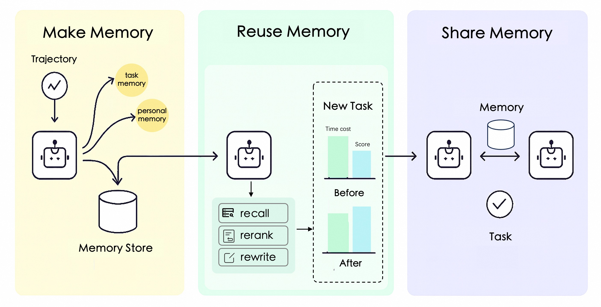

<p align="center">
 
</p>

<p align="center">
  <a href="https://pypi.org/project/reme-ai/"></a>
  <a href="https://pypi.org/project/reme-ai/"></a>
  <a href="./LICENSE"></a>
  <a href="https://github.com/agentscope-ai/ReMe"></a>
</p>

<p align="center">
  <strong>面向智能体的记忆管理工具包, Remember Me, Refine Me.</strong><br>
</p>

> ⭐ 喜欢 ReMe 吗？给仓库点个 Star，让更多开发者发现记忆驱动的智能体。<br>

<p align="center">
  <a href="./README.md">English</a> | 简体中文
</p>

---

ReMe 为智能体提供统一的记忆系统——支持在用户、任务与智能体之间提取、复用与共享记忆。

```
个人记忆 Personal + 任务记忆 Task + 工具记忆 Tool = 智能体记忆 Agent Memory
```

个人记忆用于“理解用户偏好”，任务记忆用于“提升任务表现”，工具记忆用于“更聪明地使用工具”。

---

## 🚀 为什么团队选择 ReMe

- **快速打造更聪明的智能体**：内置记忆能力和可配置流程，即插即用。
- **显著提升成功率**：在工具使用与多轮任务中验证最高可带来 **15%**+ 的效果提升（详见实验）。
- **统一管理可扩展**：跨用户、任务、工具的记忆一体化，再也不用手工维护向量库。
- **部署方式灵活**：HTTP 服务、MCP 协议、Python 直连，统一配置即可复用。
- **团队协作友好**：内置记忆库、审计留痕与指南生成，让智能体决策可复盘。

> 快速试用下方的 Quick Start，如果 ReMe 帮你节省时间或 Token，别忘了点个 ⭐。

---

## ✨ 架构设计

<p align="center">
 
</p>

ReMe 集成三类互补的记忆能力：

#### 🧠 任务记忆 / 经验记忆
可在不同智能体之间复用的程序性知识
- 成功模式识别：总结有效策略与其原理
- 失败分析学习：吸取错误避免重复
- 对比式记忆：多采样轨迹带来更有价值的经验
- 验证机制：通过验证模块确认经验有效性

详见文档：[任务记忆](docs/task_memory/task_memory.md)

#### 👤 个人记忆
面向特定用户的情境化记忆
- 个体偏好：习惯、偏好、交互风格
- 情境自适应：基于时间与上下文的智能管理
- 渐进式学习：长期交互中逐步深入理解
- 时间敏感：在检索与整合中考虑时间因素

详见文档：[个人记忆](docs/personal_memory/personal_memory.md)

#### 🔧 工具记忆
基于数据的工具选择与使用优化
- 历史表现追踪：成功率、耗时与 Token 成本
- LLM-as-Judge：为什么成功/失败的定性洞察
- 参数优化：从成功调用中学习最优参数
- 动态指南：将静态工具描述转为可演化的“活文档”

详见文档：[工具记忆](docs/tool_memory/tool_memory.md)

---

## 📰 最新进展

- [2025-10] 直接 Python 导入：`from reme_ai import ReMeApp`，无需 HTTP/MCP 服务
- [2025-10] 工具记忆：数据驱动的工具选择与参数优化（见指南 docs/tool_memory/tool_memory.md）
- [2025-09] 支持异步操作，已集成至 agentscope-runtime
- [2025-09] 集成任务记忆与个人记忆
- [2025-09] 在 Appworld、BFCL(v3)、FrozenLake 验证有效性（见 docs/cookbook）
- [2025-08] 支持 MCP 协议（见 docs/mcp_quick_start.md）
- [2025-06] 多后端向量库（Elasticsearch 与 ChromaDB）（见 docs/vector_store_api_guide.md）
- [2024-09] 个性化与时间敏感的记忆存储

---

## 🛠️ 安装

### 通过 PyPI 安装（推荐）

```bash
pip install reme-ai
```

### 从源码安装

```bash
git clone https://github.com/agentscope-ai/ReMe.git
cd ReMe
pip install .
```

### 环境变量配置

复制 `example.env` 为 `.env` 并按需修改：

```bash
FLOW_LLM_API_KEY=sk-xxxx
FLOW_LLM_BASE_URL=https://xxxx/v1
FLOW_EMBEDDING_API_KEY=sk-xxxx
FLOW_EMBEDDING_BASE_URL=https://xxxx/v1
```

---

## 🚀 快速开始

### 启动 HTTP 服务

```bash
reme \
  backend=http \
  http.port=8002 \
  llm.default.model_name=qwen3-30b-a3b-thinking-2507 \
  embedding_model.default.model_name=text-embedding-v4 \
  vector_store.default.backend=local
```

### 启动 MCP Server

```bash
reme \
  backend=mcp \
  mcp.transport=stdio \
  llm.default.model_name=qwen3-30b-a3b-thinking-2507 \
  embedding_model.default.model_name=text-embedding-v4 \
  vector_store.default.backend=local
```

### 核心 API 用法

#### 任务记忆管理

```python
import requests

# 经验总结：从执行轨迹中学习
response = requests.post("http://localhost:8002/summary_task_memory", json={
    "workspace_id": "task_workspace",
    "trajectories": [
        {"messages": [{"role": "user", "content": "Help me create a project plan"}], "score": 1.0}
    ]
})

# 记忆检索：获取相关经验
response = requests.post("http://localhost:8002/retrieve_task_memory", json={
    "workspace_id": "task_workspace",
    "query": "How to efficiently manage project progress?",
    "top_k": 1
})
```

详情可见同页下方 Python 导入 / curl / Node.js 示例，接口参数与英文版一致。

#### 个人记忆管理

```python
# 记忆整合：从用户交互中学习
response = requests.post("http://localhost:8002/summary_personal_memory", json={
    "workspace_id": "task_workspace",
    "trajectories": [
        {"messages":
            [
                {"role": "user", "content": "I like to drink coffee while working in the morning"},
                {"role": "assistant",
                 "content": "I understand, you prefer to start your workday with coffee to stay energized"}
            ]
        }
    ]
})

# 记忆检索：获取个人记忆片段
response = requests.post("http://localhost:8002/retrieve_personal_memory", json={
    "workspace_id": "task_workspace",
    "query": "What are the user's work habits?",
    "top_k": 5
})
```

#### 工具记忆管理

```python
import requests

# 记录工具调用结果
response = requests.post("http://localhost:8002/add_tool_call_result", json={
    "workspace_id": "tool_workspace",
    "tool_call_results": [
        {
            "create_time": "2025-10-21 10:30:00",
            "tool_name": "web_search",
            "input": {"query": "Python asyncio tutorial", "max_results": 10},
            "output": "Found 10 relevant results...",
            "token_cost": 150,
            "success": True,
            "time_cost": 2.3
        }
    ]
})

# 从历史生成使用指南
response = requests.post("http://localhost:8002/summary_tool_memory", json={
    "workspace_id": "tool_workspace",
    "tool_names": "web_search"
})

# 在使用前检索指南
response = requests.post("http://localhost:8002/retrieve_tool_memory", json={
    "workspace_id": "tool_workspace",
    "tool_names": "web_search"
})
```

---

## 📦 开箱即用的记忆库

ReMe 提供可直接使用的记忆文件，内含已验证的最佳实践：

### 可用记忆
- `appworld.jsonl`：Appworld 交互记忆，覆盖复杂任务规划与执行
- `bfcl_v3.jsonl`：BFCL 工具调用工作记忆

### 快速使用

```python
# 加载内置记忆
response = requests.post("http://localhost:8002/vector_store", json={
    "workspace_id": "appworld",
    "action": "load",
    "path": "./docs/library/"
})

# 查询相关记忆
response = requests.post("http://localhost:8002/retrieve_task_memory", json={
    "workspace_id": "appworld",
    "query": "How to navigate to settings and update user profile?",
    "top_k": 1
})
```

---

## 🧪 实验结果

### 🌍 Appworld 实验（qwen3-8b）

| 方法           | pass@1            | pass@2            | pass@4            |
|----------------|-------------------|-------------------|-------------------|
| 无 ReMe        | 0.083             | 0.140             | 0.228             |
| 使用 ReMe      | 0.109（+2.6%）    | 0.175（+3.5%）    | 0.281（+5.3%）    |

Pass@K 衡量在生成 K 个候选中至少一个成功完成任务（score=1）的概率。
当前实验使用内部 AppWorld 环境，可能存在轻微差异。复现实验详见 `docs/cookbook/appworld/quickstart.md`。

### 🧊 FrozenLake 实验（qwen3-8b，100 张随机地图）

| 方法           | 通过率           |
|----------------|------------------|
| 无 ReMe        | 0.66             |
| 使用 ReMe      | 0.72（+6.0%）    |

### 🔧 工具记忆基准（Qwen3-30B-Instruct）

| 场景                  | 平均分 | 提升     |
|-----------------------|--------|----------|
| 训练集（无记忆）      | 0.650  | -        |
| 测试集（无记忆）      | 0.672  | 基线     |
| 测试集（使用记忆）    | 0.772  | +14.88%  |

关键结论：
- 工具记忆可基于历史表现进行数据驱动的工具选择
- 通过学习参数配置，成功率提升约 15%

更多细节见 `docs/tool_memory/tool_bench.md` 与实现 `cookbook/tool_memory/run_reme_tool_bench.py`。

---

## 📚 资源

- 快速上手：`./cookbook/simple_demo`
  - 工具记忆演示：`cookbook/simple_demo/use_tool_memory_demo.py`
  - 工具记忆基准：`cookbook/tool_memory/run_reme_tool_bench.py`
- 向量库配置指南：`docs/vector_store_api_guide.md`
- MCP 使用指南：`docs/mcp_quick_start.md`
- 个人记忆 / 任务记忆 / 工具记忆的运算符说明与可配置流程：见 `docs/personal_memory`、`docs/task_memory`、`docs/tool_memory`
- 案例集：`./cookbook`

---

## ⭐ 社区与支持

- **Star & Watch**：Star 可以让更多智能体开发者发现 ReMe，Watch 能及时收到更新。
- **分享你的成果**：在 Issues 或 Discussions 中展示 ReMe 带来的提升，我们乐于推荐优秀案例。
- **想要新功能？** 提交需求或 PR，我们一起把记忆系统做得更强大。

---

## 🤝 参与贡献

我们相信最好的记忆系统来自群体智慧。欢迎贡献 👉 文档见 `docs/contribution.md`。

### 代码贡献
- 新操作与工具开发
- 后端实现与性能优化
- API 增强与新端点

### 文档改进
- 使用示例与教程
- 最佳实践指南

---

## 📄 引用

```bibtex
@software{AgentscopeReMe2025,
  title = {AgentscopeReMe: Memory Management Kit for Agents},
  author = {Li Yu, Jiaji Deng, Zouying Cao},
  url = {https://reme.agentscope.io},
  year = {2025}
}
```

---

## ⚖️ 许可证

本项目基于 Apache License 2.0 开源，详见 [LICENSE](./LICENSE)。

---

## Star 历史

[](https://www.star-history.com/#modelscope/ReMe&Date)


