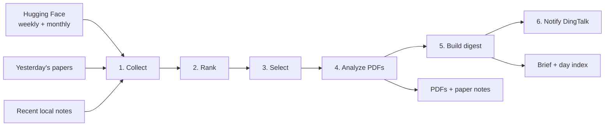

# Daily Paper Cookbook

[中文](README_ZH.md)

Daily Paper is a local-first, file-native workflow for turning research feeds into a daily reading package. It collects
papers from the Hugging Face weekly and monthly rankings, removes yesterday's papers and recent recommendations, ranks
the remaining candidates, and uses Claude Code to produce detailed Chinese paper notes and a five-minute Chinese brief.

The workflow is assembled by [`daily_cookbook.yaml`](../../reme/config/daily_cookbook.yaml). Its schemas live in
[`reme/schema/daily_paper.py`](../../reme/schema/daily_paper.py), and its steps live in
[`reme/steps/cookbook/daily_paper/`](../../reme/steps/cookbook/daily_paper/).

## Quick start

Daily Paper requires Python 3.11 or later, the `core` dependencies, network access to Hugging Face and arXiv, and
credentials for the configured Claude Code endpoint.

From the repository root:

```bash
python -m pip install -e ".[dev,core]"
export CLAUDE_CODE_API_KEY="your-api-key"
reme start config=daily_cookbook job=daily_paper
```

The built-in configuration uses `qwen3.7-max` through DashScope's Anthropic-compatible endpoint. Override
`CLAUDE_CODE_MODEL_NAME` and `CLAUDE_CODE_BASE_URL` when using another compatible model or provider.

By default, outputs are written under `.reme/` in the directory where ReMe starts.

## What it creates

A successful run writes ordinary PDFs and Markdown files beneath `workspace_dir`:

```text
.reme/
├── daily/
│   ├── YYYY-MM-DD.md
│   └── YYYY-MM-DD/
│       ├── daily-paper-brief.md
│       ├── paper-<arxiv-id>.md
│       └── ...
├── resource/
│   └── papers/
│       ├── <arxiv-id>.pdf
│       └── ...
└── mem_session/
    └── claude_config/
```

- `paper-<arxiv-id>.md` is a detailed Chinese reading note with YAML frontmatter linking back to the source PDF and
  paper pages.
- `daily-paper-brief.md` is a roughly five-minute Chinese digest with wikilinks to every selected paper note.
- `daily/YYYY-MM-DD.md` is a derived day index rebuilt from the Markdown files for that date.
- `resource/papers/` holds reusable source PDFs.

The paper notes are the source of truth for recommendation history: their frontmatter contains the `arxiv_id` values
used for future deduplication. The day index is derived and can be rebuilt. The workflow does not currently write a
separate run manifest.

## How the workflow works



### 1. Collect and deduplicate

The Collect step fetches the weekly ranking for the run date's ISO week, the monthly ranking for its calendar month,
and the Hugging Face Daily Papers IDs for exactly the previous calendar day. It merges weekly and monthly metadata by
arXiv ID and preserves each list's display rank.

It then scans `daily/<prior-date>/paper-*.md` over the configured history window and excludes IDs found in note
frontmatter. The job fails clearly if no eligible papers remain.

### 2. Rank candidates

The Rank step uses reciprocal-rank fusion:

```text
score = 1 / (rrf_k + monthly_rank)
      + weekly_weight / (rrf_k + weekly_rank)
```

A missing rank contributes zero. Candidates are ordered by fused score, upvotes, and arXiv ID. The bounded candidate
pool also reserves several positions for papers whose titles or summaries match memory-related terms such as agent
memory, memory retrieval, continual learning, context compression, knowledge graphs, and RAG. This reserve is a simple
keyword heuristic, not a semantic classifier.

### 3. Select papers

Claude Code receives the bounded candidate pool and returns a structured `PaperSelection`. The implementation requires
exactly `top_k` unique in-pool IDs with consecutive ranks. Invalid output is returned to the agent once as validation
feedback; a second invalid response fails the job.

### 4. Download and analyze PDFs

Selected papers are processed sequentially. For each paper, the workflow:

1. validates the modern arXiv ID format;
2. downloads and validates the PDF, or reuses an existing file with a valid `%PDF-` header;
3. extracts text with `pypdf`, adding page markers and applying page and character limits;
4. asks Claude Code for a structured detailed reading; and
5. writes normalized frontmatter plus the generated Markdown body.

The current extractor requires a usable PDF text layer. Scanned or image-only PDFs fail because there is no OCR
fallback. If extraction exceeds a configured limit, the note records that the input was truncated.

### 5. Build the brief and index

Claude Code reads every detailed note and produces the daily brief. The code verifies that each source-note wikilink is
present and appends any missing links before writing the file. It then rebuilds `daily/YYYY-MM-DD.md` from that day's
Markdown frontmatter.

### 6. Optionally notify DingTalk

The final step sends the brief body, without YAML frontmatter, to each configured DingTalk group in order. With no
conversation IDs it is a no-op. If one group fails, the step still attempts the remaining groups and reports the
combined failure afterward.

## Dates, reruns, and idempotency

- `date` must be an exact `YYYY-MM-DD` value. When omitted, the job uses today in the application timezone, which is
  `Asia/Shanghai` in the built-in configuration.
- “Yesterday” means `date - 1 day`, not the previous 24 hours.
- `history_days` considers prior dated note directories only; the current run date is never part of its history scan.
- If `daily/<date>/daily-paper-brief.md` already exists and `force=false`, collection, ranking, model calls, PDF work,
  and digest generation are skipped. The existing brief remains available to the DingTalk notification step.
- `force=true` regenerates the notes and brief. Existing valid PDFs are still reused.

Each PDF, detailed note, and final brief uses a temporary file followed by replacement so callers do not see a
partially written file. The complete multi-file workflow is not transactional, and there is no global lock for two
concurrent runs of the same date.

## Running the cookbook

The standalone configuration defines three jobs:

| Job                | Behavior                                                |
|--------------------|---------------------------------------------------------|
| `daily_paper`      | On-demand generation through the CLI or HTTP service    |
| `daily_paper_cron` | The same pipeline every day at 08:00 in `Asia/Shanghai` |
| `dingtalk_wait`    | A supervised background DingTalk agent                  |

### One-time runs

Generate today's brief:

```bash
reme start config=daily_cookbook job=daily_paper
```

Generate a specific date with selected overrides:

```bash
reme start \
  config=daily_cookbook \
  job=daily_paper \
  date=2026-07-21 \
  top_k=3 \
  history_days=30
```

Regenerate a date whose brief already exists:

```bash
reme start config=daily_cookbook job=daily_paper date=2026-07-21 force=true
```

Add `service.show_metadata=true` to a one-time command when the response metadata is useful for diagnostics.

### Long-running service and cron

Start the standalone HTTP service and its scheduled/background jobs:

```bash
reme start config=daily_cookbook
```

It listens on `127.0.0.1:8001` by default, so it can run beside the default ReMe service. Call the on-demand job from
another terminal with either the ReMe client or HTTP:

```bash
reme daily_paper host=127.0.0.1 port=8001
```

```bash
curl -s http://127.0.0.1:8001/daily_paper \
  -H 'Content-Type: application/json' \
  -d '{"date":"2026-07-21","top_k":3,"force":false}'
```

Service and schedule settings can be overridden at startup:

```bash
reme start \
  config=daily_cookbook \
  service.host=0.0.0.0 \
  service.port=8101 \
  jobs.daily_paper_cron.cron="30 7 * * *"
```

## Configuration

The most useful job settings are:

| Setting           |      Default | Purpose                                                      |
|-------------------|-------------:|--------------------------------------------------------------|
| `candidate_limit` |         `20` | Maximum number of papers sent to selection                   |
| `memory_reserve`  |          `5` | Candidate positions reserved by the memory-keyword heuristic |
| `top_k`           |          `3` | Number of papers selected and analyzed                       |
| `rrf_k`           |         `60` | Reciprocal-rank fusion constant                              |
| `weekly_weight`   |        `0.7` | Weight of the weekly ranking in fusion                       |
| `history_days`    |         `30` | Prior recommendation window excluded by arXiv ID             |
| `hf_timeout`      | `30` seconds | Hugging Face request timeout                                 |
| `hf_max_retries`  |          `3` | Maximum Hugging Face request attempts                        |
| `pdf_timeout`     | `90` seconds | arXiv download timeout                                       |
| `max_pdf_bytes`   |   `52428800` | Maximum PDF size (50 MiB)                                    |
| `max_pdf_pages`   |         `80` | Maximum pages extracted for analysis                         |
| `max_pdf_chars`   |     `240000` | Maximum extracted characters sent for one paper              |

The public job parameters are `date`, `force`, `top_k`, `weekly_weight`, and `history_days`. Explicit invocation values
take precedence over the job defaults.

The standalone application also accepts these environment variables:

| Variable                                | Purpose                                         |
|-----------------------------------------|-------------------------------------------------|
| `DAILY_PAPER_WORKSPACE_DIR`             | Overrides the default `.reme` workspace         |
| `DAILY_PAPER_PROJECT_PATH`              | Repository/project path visible to Claude Code  |
| `DAILY_PAPER_HOST` / `DAILY_PAPER_PORT` | HTTP bind address                               |
| `CLAUDE_CODE_API_KEY`                   | API key for the configured Claude Code endpoint |
| `CLAUDE_CODE_MODEL_NAME`                | Model override                                  |
| `CLAUDE_CODE_BASE_URL`                  | Anthropic-compatible endpoint override          |

`DAILY_PAPER_PROJECT_PATH` defaults to `..` relative to the workspace. With the default `.reme` workspace, starting
from the repository root resolves it back to the repository. If the workspace lives elsewhere, set both paths
explicitly.

ReMe loads an uncommitted `.env` file found from the current directory upward, so the same values may be placed there
instead of exported in the shell.

## DingTalk configuration

DingTalk is optional. Configure it only when brief delivery or the background DingTalk agent is needed:

```dotenv
DINGTALK_APP_KEY=your-app-key
DINGTALK_APP_SECRET=your-app-secret
DINGTALK_ROBOT_CODE=your-robot-code
DINGTALK_CONVERSATION_IDS=cid-group-one,cid-group-two
```

`DINGTALK_CONVERSATION_IDS` is required only for proactive brief delivery. The background `dingtalk_wait` job uses the
first three credentials but not the conversation list.

## Failure recovery and boundaries

| Situation                            | Behavior                                                             |
|--------------------------------------|----------------------------------------------------------------------|
| Temporary Hugging Face failure       | Retries with exponential delay up to `hf_max_retries` attempts       |
| No eligible papers                   | Fails before ranking                                                 |
| Invalid `top_k` or selection output  | Fails after validation; selection output gets one retry              |
| Oversized, invalid, or textless PDF  | Stops during analysis                                                |
| PDF exceeds page or character limits | Continues with truncated text and records the truncation             |
| One paper analysis fails             | Stops the job; earlier PDFs and notes remain on disk                 |
| Brief misses a source-note link      | Appends the missing wikilink before writing                          |
| Existing final brief                 | Skips generation unless `force=true`; notification can still send it |
| Concurrent runs for one date         | No pipeline-level lock; later writes may replace earlier results     |

To recover, inspect the date's notes and PDFs, fix the network, credential, model, or PDF issue, then rerun the same
date with `force=true`. Valid cached PDFs will be reused.

The built-in Claude Code component runs with `permission_mode: bypassPermissions`. ReMe disables Claude Code's
`WebSearch` tool, and the analysis/digest prompts constrain what the agent should read, but these steps do not set a
strict per-call tool allowlist or an operating-system sandbox. Run the cookbook only with a trusted project and
workspace, and tighten the agent configuration before shared or production use.

## Tests

The focused unit suite mocks Hugging Face, arXiv, Claude Code, and DingTalk boundaries:

```bash
pytest tests/unit/test_daily_paper.py -v
```

Real runs access external services and may incur model costs; they should not be used as ordinary unit tests.
