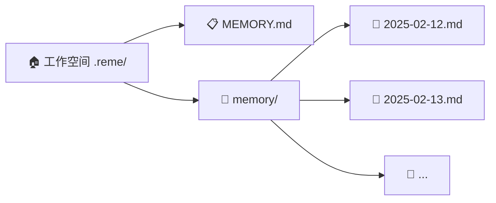
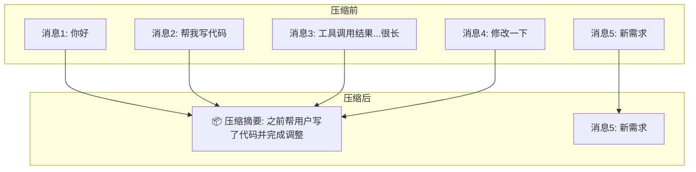

 # ReMe CLI 快速开始

## 🧠 记忆管理：为什么 AI 需要"记事本"？

大语言模型的上下文窗口就像一个**有限容量的背包** 🎒——每轮对话、每次工具调用都在往里塞东西。背包满了会怎样？

- 🚫 **对话中断** — 无法继续交流
- 📉 **质量下降** — AI 开始"健忘"，丢失关键上下文
- ❌ **跨对话失忆** — 新对话完全不记得之前聊过什么

更关键的是：即使背包没满，**每次新对话都是一张白纸**。上次讨论的项目决策、你的技术偏好、进行到一半的任务——全部归零。

ReMe 为你提供两大核心能力来解决这些问题：

| 能力            | 比喻           | 解决的问题                       |
|---------------|--------------|-----------------------------|
| 🗜️ **上下文压缩** | 整理背包的贴心管家 🧹 | 对话太长时，自动将旧内容浓缩为精华摘要，腾出空间    |
| 📚 **长期记忆**   | 随身携带的记事本 📓  | 关键信息写入文件持久保存，下次对话通过语义搜索自动召回 |

---

## 示例

https://github.com/user-attachments/assets/befa7e40-63ba-4db2-8251-516024616e00

---
## 📁 基于文件系统的记忆设计

ReMe 的长期记忆不依赖任何外部数据库——**Markdown 文件就是你的记忆**。简单、透明、可直接编辑。
> 记忆设计受 [OpenClaw](https://github.com/openclaw/openclaw) 记忆架构启发。

### 记忆文件结构



### MEMORY.md — 长期记忆（你的"个人档案"）

存放长期有效、极少变动的关键信息，就像一本**个人百科**：

- **位置**：`{working_dir}/MEMORY.md`
- **内容示例**：项目使用 Python 3.12、偏好 pytest 框架、数据库选型为 PostgreSQL
- **更新方式**：Agent 通过 `write` / `edit` 工具自动写入

### memory/YYYY-MM-DD.md — 每日日志（你的"工作日记"）

每天一页，追加写入，记录当天的工作与交互：

- **位置**：`{working_dir}/memory/YYYY-MM-DD.md`
- **内容示例**：今天修复了登录 Bug、部署了 v2.1、讨论了缓存策略
- **更新方式**：Agent 通过 `write` / `edit` 工具追加写入；上下文压缩时自动触发

---

## 📦 安装

### 从 PyPI 安装（推荐）

```bash
pip install reme-ai --pre
```

### 从源码安装

```bash
git clone https://github.com/agentscope-ai/ReMe.git
cd ReMe
pip install -e .
```

> 要求 Python >= 3.10

---

## ⚙️ 配置

### 环境变量

除了 yaml 配置外，以下环境变量用于配置 API 密钥，可以放到根目录的.env文件中：

| 环境变量                      | 说明                     | 示例                                                  |
|---------------------------|------------------------|-----------------------------------------------------|
| `REME_LLM_API_KEY`        | LLM 服务的 API Key        | `sk-xxx`                                            |
| `REME_LLM_BASE_URL`       | LLM 服务的 Base URL       | `https://dashscope.aliyuncs.com/compatible-mode/v1` |
| `REME_EMBEDDING_API_KEY`  | Embedding 服务的 API Key  | `sk-xxx`                                            |
| `REME_EMBEDDING_BASE_URL` | Embedding 服务的 Base URL | `https://dashscope.aliyuncs.com/compatible-mode/v1` |
> 如果没有embedding，搜索效果会受限，同时请配置vector_enabled=false

### 联网搜索（可选）

| 环境变量                | 说明                                      |
|---------------------|-----------------------------------------|
| `TAVILY_API_KEY`    | Tavily 搜索 API Key                       |
| `DASHSCOPE_API_KEY` | DashScope 百炼 LLM(enable search) API Key |
> 两者配置其一即可；优先使用 Tavily。

---

### 配置文件 cli.yaml

`remecli` 启动时默认加载 [cli.yaml](https://github.com/agentscope-ai/ReMe/blob/main/reme/config/cli.yaml) 配置文件（`config_path="cli"`）。这是整个 CLI 的**中枢配置**，就像飞机的仪表盘 🛫——所有核心参数都在这里集中管理：

#### 📐 参数详解

**基础配置**

| 参数            | 值       | 说明                                     |
|---------------|---------|----------------------------------------|
| `backend`     | `cmd`   | 运行模式，CLI 使用 `cmd`                      |
| `working_dir` | `.reme` | 工作空间目录，记忆文件（MEMORY.md、memory/*.md）存放于此 |

**metadata — 上下文窗口与检索参数** 🎒

这些参数控制"背包管家"如何管理上下文空间和记忆检索：

| 参数                      | 默认值      | 说明                                    |
|-------------------------|----------|---------------------------------------|
| `context_window_tokens` | `100000` | 上下文窗口总容量（token），背包的**总大小**            |
| `reserve_tokens`        | `30000`  | 为输出和系统开销预留的 token，背包里**留给新东西的空间**     |
| `keep_recent_tokens`    | `10000`  | 压缩后保留的最近对话 token，**最新鲜的对话**不会被压缩      |
| `vector_weight`         | `0.7`    | 混合检索中向量搜索的权重（BM25 权重 = 1 - 0.7 = 0.3） |
| `candidate_multiplier`  | `2`      | 检索候选池扩大倍数，越大召回越全但越慢                   |

> 💡 自动压缩触发条件：当消息 token 数 ≥ `context_window_tokens - reserve_tokens`（即 100000 - 30000 = 70000）时触发。

**llms — LLM 模型配置** 🧠

| 参数                 | 说明                      |
|--------------------|-------------------------|
| `backend`          | LLM 后端类型，使用 OpenAI 兼容接口 |
| `model_name`       | 模型名称，默认使用通义千问           |
| `request_interval` | 请求间隔（秒），用于速率控制          |

**embedding_models — Embedding 模型配置** 🔍

| 参数           | 说明                                    |
|--------------|---------------------------------------|
| `backend`    | Embedding 后端类型                        |
| `model_name` | Embedding 模型名称，默认 `text-embedding-v4` |
| `dimensions` | 向量维度，`1024` 维                         |

**memory_stores — 记忆存储后端** 💾

| 参数                | 说明                           |
|-------------------|------------------------------|
| `backend`         | 存储后端，默认使用 `chroma`（ChromaDB） |
| `db_name`         | 数据库文件名                       |
| `store_name`      | 集合名称                         |
| `embedding_model` | 引用的 Embedding 模型配置名          |
| `fts_enabled`     | 是否启用 BM25 全文检索               |
| `vector_enabled`  | 是否启用向量语义搜索                   |

> 🔧 推荐同时启用 `fts_enabled` 和 `vector_enabled`，使用混合检索获得最佳召回效果。

**file_watchers — 文件监控配置** 👁️

| 参数               | 说明                 |
|------------------|--------------------|
| `backend`        | 监控模式，`full` 为全量扫描  |
| `memory_store`   | 关联的记忆存储配置名         |
| `watch_paths`    | 监控的目录/文件路径列表       |
| `suffix_filters` | 只监控指定后缀的文件（`.md`）  |
| `recursive`      | 是否递归监控子目录          |
| `scan_on_start`  | 启动时是否全量扫描一次，确保索引完整 |

**token_counters — Token 计数器** 🔢

| 参数        | 说明                            |
|-----------|-------------------------------|
| `backend` | 计数器后端，`base` 使用默认 tiktoken 计数 |

## 🚀 启动 CLI

```bash
remecli config=cli
```

启动时自动加载 [cli.yaml](https://github.com/agentscope-ai/ReMe/blob/main/reme/config/cli.yaml) 配置。

现在你可以直接和 Remy 对话了！ReMe 会在后台自动管理上下文压缩和长期记忆。

---

## 📟 系统命令

在对话中输入以 `/` 开头的命令来控制对话状态：

| 命令         | 说明                      | 需要等待 |
|------------|-------------------------|------|
| `/compact` | 手动压缩当前对话为摘要，同时后台保存到长期记忆 | ⏳ 是  |
| `/new`     | 清空上下文开始新对话，后台保存历史到长期记忆  | ⚡ 否  |
| `/clear`   | 完全清空上下文（**不保存**到长期记忆）   | ⚡ 否  |
| `/history` | 查看当前对话中所有未压缩的消息         | ⚡ 否  |
| `/help`    | 显示可用命令列表                | ⚡ 否  |
| `/exit`    | 退出 CLI                  | ⚡ 否  |

### 命令对比

| 命令         | 压缩摘要     | 长期记忆   | 消息历史       |
|------------|----------|--------|------------|
| `/compact` | 📦 生成新摘要 | ✅ 后台保存 | 🏷️ 保留最近消息 |
| `/new`     | 🗑️ 清空   | ✅ 后台保存 | 🗑️ 完全清空   |
| `/clear`   | 🗑️ 清空   | ❌ 不保存  | 🗑️ 完全清空   |

> ⚠️ `/clear` 是不可逆的——清除的内容不会被保存到任何地方。

---

## 🛠️ ReMeCli 能力介绍

ReMeCli 是一个功能完整的终端 AI 助手，装备了丰富的工具集。就像一个随身携带整套工具箱的工程师 🧰：

### 何时写入记忆？

| 触发场景                | 写入目标                   | 方式                      |
|---------------------|------------------------|-------------------------|
| 🤖 上下文溢出自动压缩        | `memory/YYYY-MM-DD.md` | 后台自动触发                  |
| 🎮 用户执行 `/compact`  | `memory/YYYY-MM-DD.md` | 手动触发压缩 + 后台保存           |
| 🆕 用户执行 `/new`      | `memory/YYYY-MM-DD.md` | 立即开始新对话 + 后台保存          |
| 💬 用户说"记住这个"        | `MEMORY.md` 或日志        | Agent 通过 `write` 工具立即写入 |
| 🔑 Agent 识别到关键决策/偏好 | `MEMORY.md`            | Agent 主动写入              |

### 记忆检索

Agent 有两种方式找回过去的记忆：

| 方式      | 工具              | 适用场景           | 示例                        |
|---------|-----------------|----------------|---------------------------|
| 🔍 语义搜索 | `memory_search` | 不确定记在哪，按意图模糊召回 | "之前关于部署流程的讨论"             |
| 📖 直接读取 | `read`          | 已知日期或文件路径，精确查阅 | 读取 `memory/2025-02-13.md` |

搜索采用**向量 + BM25 混合检索**（默认向量权重 0.7，BM25 权重 0.3），两种信号互补，无论是自然语言提问还是精确查找都能获得可靠结果。


### 内置工具一览

| 工具                 | 能力           | 说明                                       |
|--------------------|--------------|------------------------------------------|
| 🔍 `memory_search` | 记忆语义搜索       | 在 MEMORY.md 和 memory/*.md 中进行向量+BM25混合检索 |
| 🖥️ `bash`         | 执行终端命令       | 运行任意 bash 命令，支持超时控制和输出截断                 |
| 📂 `ls`            | 列出目录         | 浏览目录结构，支持条目数限制                           |
| 📖 `read`          | 读取文件         | 读取文本文件和图片，支持 offset/limit 分段读取           |
| ✏️ `edit`          | 精确编辑文件       | 通过精确文本匹配进行外科手术式修改                        |
| 📝 `write`         | 写入文件         | 创建或覆盖文件，自动创建父目录                          |
| 🐍 `execute_code`  | 执行 Python 代码 | 动态运行 Python 代码片段                         |
| 🌐 `web_search`    | 联网搜索（可选）     | 通过 Tavily 或 DashScope 进行实时网络搜索           |

---

## 🔄 上下文压缩机制

压缩就像写**会议纪要** 📋——把冗长的讨论浓缩成关键要点，同时保留最近的讨论内容不变。

ReMe 提供两种压缩方式，就像汽车的**自动挡和手动挡** 🚗：

### 🤖 自动压缩（自动挡）

每次对话前，ReMe 像一个贴心管家 🧹 检查背包还剩多少空间。当 token 超过阈值（`context_window_tokens - reserve_tokens`）时自动整理：



### 🎮 手动压缩（手动挡）

随时输入 `/compact` 强制压缩**所有**当前消息，不受阈值限制。

### 摘要保留什么？

| 部分       | 内容            | 举例                          |
|----------|---------------|-----------------------------|
| 🎯 目标    | 用户想要完成什么      | "构建一个用户登录系统"                |
| ⚙️ 约束和偏好 | 用户提到的要求       | "使用 TypeScript，不要用任何框架"     |
| 📈 进展    | 完成/进行中/阻塞的任务  | "登录接口已完成，注册接口进行中"           |
| 🔑 关键决策  | 做出的决策及原因      | "选择 JWT 而非 Session，因为需要无状态" |
| ➡️ 下一步   | 接下来要做什么       | "实现密码重置功能"                  |
| 📌 关键上下文 | 文件路径、函数名、错误信息 | "主文件在 src/auth.ts"          |
