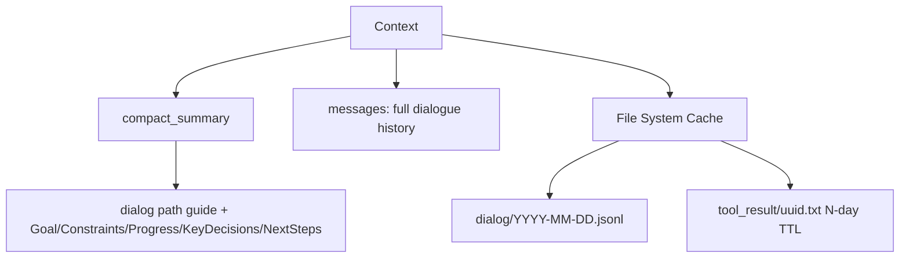
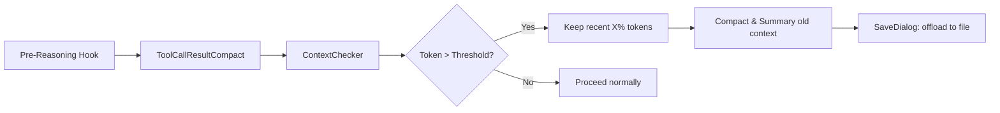
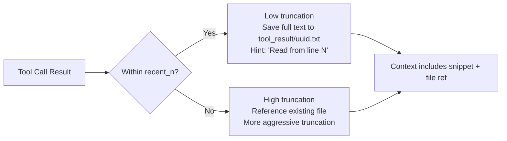
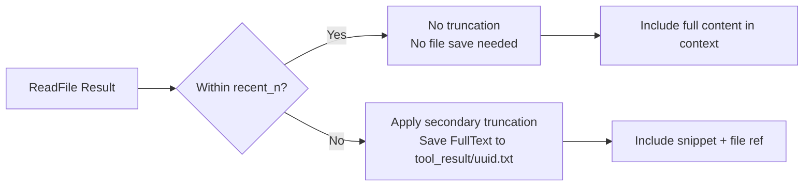
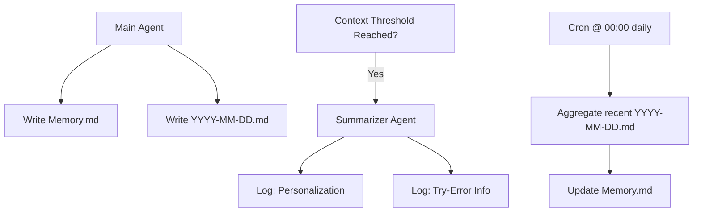

## Copaw Context Management V2

> 注：不涉及长期记忆

### 上下文数据结构

#### 1. 上下文-内存

- **compact_summary**（可选）：
    - **历史对话原始数据引导**：存储于 `dialog/YYYY-MM-DD.jsonl`，共 N 行，按时间顺序排列；回顾时建议从后往前读。
    - **历史对话摘要**：包含 `Goal + Constraints + Progress + KeyDecisions + NextSteps`。
- **messages**：当前对话上下文（完整消息列表）。

#### 2. 上下文-缓存到文件系统

- **历史对话原始数据**：`dialog/YYYY-MM-DD.jsonl`
- **工具调用结果原始数据**：`tool_result/{uuid}.txt`（保留 N 天）

---

### 上下文机制（Pre-Reasoning Hook）

1. **工具结果 Offload** (`ToolCallResultCompact`)
2. **上下文检查** (`ContextChecker`)
3. **若 Token 超阈值**：
    - 保留最近 **X%** 的 Token（保障连贯性）
    - 其余历史对话生成摘要 (`Compactor`)
4. **被摘要的上下文 Offload 到文件系统** (`SaveDialog`)

---

### 工具结果 Offload 机制

1. 所有工具调用结果先放入上下文，等待 Pre-Reasoning Hook 处理。
2. 根据是否属于 **recent_n** 范围，决定截断策略：
    - **recent_n 内**：近期内容 → 低截断比例
    - **recent_n 外**：远期内容 → 高截断比例

#### 示例：Browser Use 类工具

| 阶段 | 行为                                                                           |
|----|------------------------------------------------------------------------------|
| 1  | 原始工具调用结果                                                                     |
| 2  | 保存原始内容到文件：– 若在 recent_n 内：截断较少– 附注：“FullText saved to xxxx”– 提示：“请从第 N 行开始读” |
| 3  | 若再次引用且超出 recent_n：– 二次截断（更激进）– 仍指向原文件路径                                      |

---

### ReadFile 工具调用结果变化示例

| 阶段 | 行为                                          |
|----|---------------------------------------------|
| 1  | 原始工具调用结果                                    |
| 2  | 若在 recent_n 内：– 不截断– 不保存文件（因内容已由用户指定）       |
| 3  | 若超出 recent_n：– 二次截断（更小）– 保存 FullText 到文件并引用 |

> 注：ReadFile 本身读取的是外部文件，因此首次调用通常无需重复保存。

---

## Copaw Memory

### 触发逻辑

1. **主 Agent 主动写入**：
    - `Memory.md`（长期记忆主干）
    - `YYYY-MM-DD.md`（当日日志）
2. **触发阈值时**，由 **Summarizer（React Agent）** 写日志：
    - 个性化信息（如偏好、习惯）
    - Try-error 信息（失败尝试与修正）
3. **定时任务**（每日 00:00）：
    - 汇总最近的 `YYYY-MM-DD.md` 文件
    - 更新 `Memory.md`

