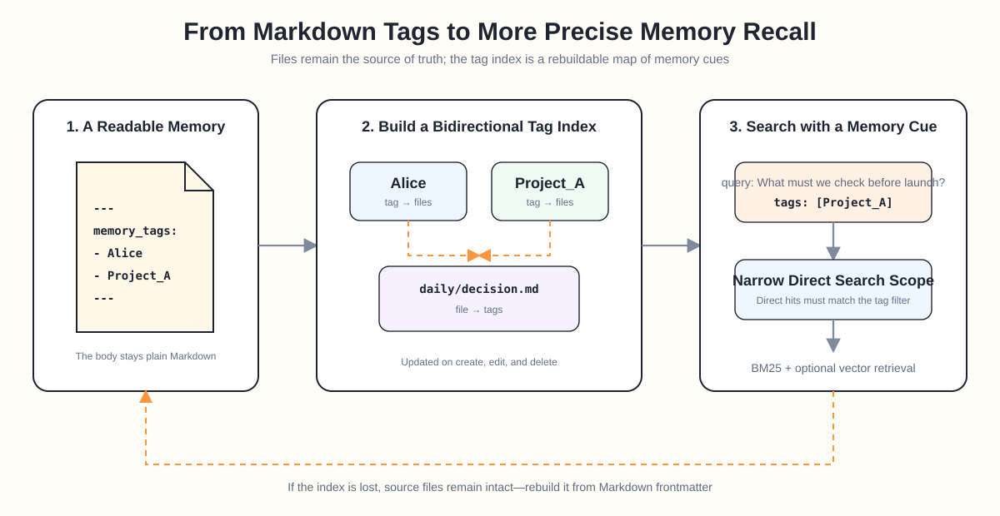

# ReMe Memory Tags

Any memory system used over the long term eventually runs into a deceptively simple problem: **as memories accumulate, how do you search only the right subset?**

Suppose you and an agent have discussed three projects, all involving a launch, a budget, and an owner. Six months later, you ask:

> "What else do we need to confirm before launch?"

There is nothing wrong with the question, but it provides too few cues. Keyword search may retrieve every document that mentions "launch," while semantic search may blend experiences from several similar projects. Both find memories with similar content, but neither necessarily knows which project, company, or person you mean right now.

Human recall rarely works this way. We seldom run a full-text search across every experience at once. Instead, we begin with a few cues: **the ones about Alice, Project A, or that discussion from last year.** Once the scope narrows, the details begin to surface.

That is why ReMe adds memory tags. Each Markdown memory can express not only what it says, but also who or what it is mainly about—and that cue can participate directly in retrieval.

<p align="center">
  
</p>

## Why Memory Tags?

ReMe already uses BM25 for keyword search, optional embeddings for semantic similarity, and Wikilinks for traversing relationships between memories. Memory tags do not replace any of them. They add another dimension: **retrieval scope.**

Think of the three mechanisms as answering different questions:

- The query answers, "What am I looking for now?"
- A Wikilink answers, "Which memories are related to this one?"
- A memory tag answers, "Which memories should I search first?"

For example, "How did we handle the budget overrun?" may apply to many projects. If the search also includes `Project_A`, the agent can first narrow the scope to files related to Project A, then look for the specific details about the overrun.

Directories cannot fully solve this problem. A meeting note may concern Alice, Project A, and a customer at the same time, but a file normally occupies only one place on disk. Tags give the same memory multiple entry points without changing its original directory structure.

## Let Each Memory Say Who or What It Is About

ReMe memories remain plain Markdown. Tags live directly in YAML frontmatter, for example:

```markdown
---
name: Project A pre-launch checklist
description: Alice confirmed the launch window, rollback conditions, and customer notification order.
memory_tags:
  - Alice
  - Project_A
---

Project A is scheduled to launch on Thursday evening. Complete regression
testing first and have Alice confirm the customer notification. Roll back if
the error rate exceeds the agreed threshold.
```

The default field is named `memory_tags`. The name is intentional: this is not a loose collection of broad article keywords. It answers a more stable question:

> **Which real-world person or thing is this Markdown memory about?**

An entity can be a person, organization, company, project, or asset—for example, `Alice`, `CATL`, `Project_A`, or `Gold`. Compared with broad topics such as "work," "important," or "meeting," entities make better anchors for long-term memory because people, organizations, and projects tend to recur across many conversations.

In the default configuration, Auto Memory (`auto_memory`, `auto_memory_cc`) and Auto Dream (`auto_dream`, `dream_cron`) generate these tags for daily and digest Markdown files actually added or modified during the current run. Before tagging, the workflow reads the full document and its existing frontmatter, then checks tags already used in the workspace. It prefers an existing spelling for the same entity so that `Project_A`, `project a`, and `项目A` do not silently become three separate tags. Manual imports and edits do not trigger automatic tagging; existing `memory_tags` values are synchronized to the Tag Index by the file-watching workflow.

By default, a file receives only its most important entity. Multiple tags are used only when the document genuinely centers on multiple independent entities, and the total remains limited. A document without a clear core entity can use an empty list:

```yaml
memory_tags: []
```

This matters more than tagging for its own sake. More tags do not make a memory richer; too many broad tags only turn every filtered search back into a workspace-wide search.

Of course, `memory_tags` is only ReMe's default convention. The frontmatter field read by the tag index is configurable, and tag values remain under the user's control. Teams that already use `entities`, `people`, or another field can adapt the index to their files instead of migrating Markdown into a closed format.

## How Does the Tag Index Work?

After reading frontmatter, ReMe builds two simple cue maps: which files belong to a tag, and which tags belong to a file. For example:

```text
Alice       -> daily/project-a-launch.md
Project_A   -> daily/project-a-launch.md

daily/project-a-launch.md -> Alice, Project_A
```

This is a bidirectional index derived from Markdown files. Relationships update when memories are created or modified, and stale relationships disappear when files are deleted. Tag comparison is case-insensitive and normalizes details such as whitespace, reducing accidental splits caused by spelling variations.

The index does not replace files or become a new source of truth. The real tags remain in user-visible, editable frontmatter. If the index is lost, it can be rebuilt from the Markdown metadata in the current file graph:

```bash
reme reindex scope=tag
```

This follows ReMe's usual principle: **files belong to the user, indexes serve the files, and indexes are always rebuildable.**

To inspect the tags in a workspace and see how many files each tag covers, list them directly:

```bash
reme list_tags order_by=file_count order=desc
```

Besides supporting search, this makes the structure of the memory workspace observable. You can quickly see that a project has accumulated many memories, or notice that one person's name has been split across several near-duplicate spellings.

## How Do Tags Participate in Search?

The most important role of memory tags is not display, but filtering.

Consider the earlier example. A natural-language query by itself looks like this:

```bash
reme search query="What else do we need to confirm before launch?"
```

That searches the entire searchable memory scope. Add a tag:

```bash
reme search \
  query="What else do we need to confirm before launch?" \
  tags='["Project_A"]'
```

ReMe first uses the Tag Index to find files tagged `Project_A`. BM25 and optional vector retrieval then produce direct matches only from those files, after which ranking fusion proceeds as usual.

There is one important boundary: tag filtering constrains direct retrieval hits, but it does not cut off Wikilink relationships. Default link expansion may still list the paths, names, and descriptions of neighboring memories outside the tag scope so the agent can decide whether to read further. Those neighbors do not become direct keyword or vector-search hits merely because they were listed.

The flow can be summarized as follows:

```text
Natural-language question + tag cue
                  ↓
Tag Index identifies candidate files
                  ↓
Keyword / semantic search within those files
                  ↓
Return direct matching passages and optionally list relationships
(related neighbors may fall outside the tag scope)
```

Tag filtering can also be combined with date conditions—for example, to inspect memories created for a project during the last month. Each condition narrows a separate dimension: the entity specifies who or what, the date specifies when, and the query specifies what you want to know.

When several tags are supplied, ReMe currently keeps files that match any of them. For example, `tags=[Alice, Project_A]` retrieves memories about Alice or Project A, then lets the query determine which results rank first. This lets an agent widen the candidate set with several plausible entity cues without returning to a workspace-wide search.

## What Changes in Practice?

Memory tags do not make a tag mandatory for every search. Searches without tags continue to work as before. The real change is that when a user or agent already knows part of the context, that context no longer has to remain hidden inside a vague query.

### 1. The Same Question Is Less Likely to Drift into Another Project

"Why was it delayed last time?", "Who approved the budget?", and "What remains before launch?" all depend heavily on context. Tags establish the project or person first, reducing the chance that memories with similar names or content enter the candidate set.

### 2. Memories About the Same Entity Can Accumulate Across Time

Alice may appear in meeting notes, project decisions, personal preferences, and retrospectives. Those files do not need to move into one directory. A shared tag creates an entity view across directories and dates.

### 3. Memory Structure Is Visible to Both People and Agents

Tags are not internal fields hidden in a specialized database. Users can open, edit, and review them in Markdown. An agent can inspect the tags that exist before deciding which entity cue to include in a search. Incorrect tags can be found, and naming can converge over time.

### 4. Search Becomes Easier to Explain

When a result is unexpected, the pipeline can be inspected step by step: does the document contain the right `memory_tags`, does the Tag Index include the path, or did keyword and semantic ranking fail to match it? This chain is easier to diagnose and correct than one opaque relevance score.

## Tags Are Retrieval Cues, Not a Taxonomy

The goal is not to turn a personal knowledge base into a carefully maintained classification tree. Real memories naturally overlap: one conversation may involve both a person and a project, while one decision may belong to today's meeting and shape a retrospective months later.

Memory tags are closer to the retrieval cues used by human memory. Seeing a person's name reminds us of shared experiences; thinking about a project brings related decisions, problems, and commitments to mind. A cue is not the memory itself, but it helps us enter the right context faster.

What ReMe does is deliberately simple:

- Preserve complete, readable memories in Markdown.
- Use `memory_tags` to express who or what a memory is about.
- Connect entities and files through a rebuildable Tag Index.
- Narrow the scope by tag before using keywords, semantics, and links to find the answer.

In this way, memory becomes more than a collection of full-text-searchable documents. It begins to acquire a structure that better matches how people associate ideas.

When you say, "That Alice project from last time," the agent receives more than a sentence. It receives a cue it can actually follow back into the past.
