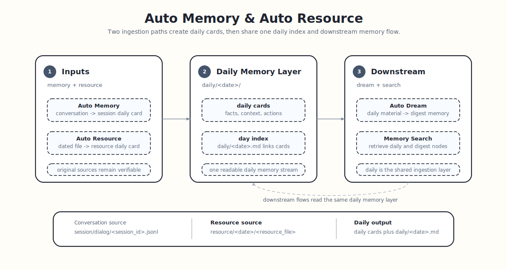

# Auto Memory

Auto Memory 是 ReMe 的对话记忆入口：每段对话先按 `session_id` 沉淀成一张 daily 记忆卡片，再由当天的 `YYYY-MM-DD.md`
统一索引。它负责把“聊过”变成“记住”，并把原始对话留好出处。

<p align="center">
  
</p>

关于 `daily/`、`session/`、frontmatter 和 wikilink 的通用文件语义，见 [Memory as File](./memory_as_file.md)。

```text
Conversation
  ├─ step 1: daily/YYYY-MM-DD/<session_id>.md        # 每段对话先成卡片
  ├─ step 2: daily/YYYY-MM-DD.md                     # 当天索引再串起来
  └─ source: session/dialog/<session_id>.jsonl  # 原始对话
```

## 它记录什么

它不记录聊天流水账，只记录以后可能还会用到的内容：

- 用户偏好：喜欢什么风格、习惯怎么协作、长期要求是什么。
- 关键事实：项目背景、重要数字、明确结论、限制条件。
- 过程决定：发生了什么，为什么这么选，哪些方案被放弃。
- 当前状态：做到哪一步，卡在哪里，下一步是什么。
- 可复用经验：命令、流程、排查方法、解决方案。

## 写入位置

Auto Memory 会把整理后的记忆放进 `daily/`。当天发生的对话会先被整理成一张张小卡片：

示例目录：

```text
workspace/
  daily/
    2026-06-20.md
    2026-06-20/
      session-a.md
      session-b.md
```

其中 `daily/2026-06-20/session-a.md`、`daily/2026-06-20/session-b.md` 是不同对话整理出的记忆卡片，
`daily/2026-06-20.md` 是当天索引页。资源文件也会进入同一个 daily 记忆层，见 [Auto Resource](./auto_resource.md)。

当调用时带上 `session_id`，Auto Memory 会按这个 id 单独记录这段对话：

```text
daily/2026-06-20/session-a.md
```

这样不同对话不会混在一起。一次需求讨论、一次问题排查、一次文档修改，都可以拥有自己的记忆卡片。以后想知道这一天发生了什么，先看
`YYYY-MM-DD.md`；想看某段对话沉淀了什么，再进入对应的 `<session_id>.md`。

## 同时保存原始信息

整理后的 daily note 负责“好读”，原始对话负责“可信”。

Auto Memory 在生成记忆卡片的同时，也会保存原始会话：

```text
session/
  dialog/
    session-a.jsonl
    session-b.jsonl
```

daily note 会指向对应的原始对话。需要核对某条记忆时，可以顺着链接回到当时的完整上下文。

## 消息时间

Auto Memory 会在 prompt 和原始会话 JSONL 中保留每条消息的 `created_at`。导入历史对话或 benchmark 数据时，建议为每条
message 提供真实发生时间，避免模型把事件时间误解为运行时间：

```bash
reme auto_memory \
  session_id=locomo-session \
  messages='[
    {"role":"user","content":"Jon lost his job today.","created_at":"2023-01-19T08:00:00"},
    {"role":"assistant","content":"I am sorry to hear that.","created_at":"2023-01-19T08:01:00"}
  ]'
```

为了兼容常见数据集字段，`auto_memory` 也会在缺少 `created_at` 时读取 `time_created`、`timestamp`、`createdAt`、
`timeCreated` 或 `created_time`。这些字段可以放在 message 顶层，也可以放在 `metadata` 中。

当调用没有显式传入 `date` 时，Auto Memory 会使用消息中最早的有效 `created_at` 日期作为 daily note 日期；如果消息没有有效时间，
则回退到当前日期。历史导入也可以显式指定目标日期：

```bash
reme auto_memory \
  session_id=locomo-session \
  date=2023-01-19 \
  messages='[{"role":"user","content":"Jon lost his job today."}]'
```

## 后续流向

Auto Memory 只生成 daily 层记忆。要把这些材料进一步沉淀为长期 `digest/` 节点，使用 [Auto Dream](./auto_dream.md)；要搜索
daily 和 digest，使用 [Memory Search](./memory_search.md)。
