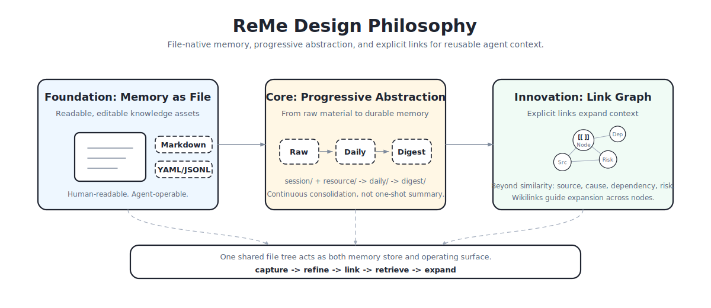

# 概览

<em>Remember Me, Refine Me —— 面向 AI Agent 的记忆管理工具箱</em>

  

ReMe 把对话和资源转化为**可读、可写、可检索的文件化长期记忆**：长期记忆不再藏在黑盒数据库里，
而是落在 workspace 目录中的 Markdown 文件里，用户和 Agent 都能直接读写、移动、删除。

## ✨ 核心理念

::::{grid} 1 1 2 2
:gutter: 3

:::{grid-item-card} 📄 文件即记忆
Markdown 文件 + frontmatter + wikilink 作为记忆节点，用户和 Agent 都能直接编辑。
:::

:::{grid-item-card} 🌱 自进化知识库
Auto Memory / Resource / Dream 把对话与资源逐步沉淀为长期记忆，并自动织入 wikilink 关系。
:::

:::{grid-item-card} 🔎 渐进式混合检索
wikilink + BM25 + 向量召回，融合关键词匹配、语义召回与关系展开。
:::

:::{grid-item-card} 🤝 Agent 友好集成
`SKILL.md` + CLI 集成，让不同 Agent 都能读、写、维护和复用记忆。
:::

::::

## 🔄 记忆流水线

ReMe 的能力沿一条 **写入 → 沉淀 → 读取** 的流水线组织：

- **写入** —— [Auto Memory](auto_memory.md) 把对话沉淀为 daily 卡片，
  [Auto Resource](auto_resource.md) 解读资源文件。
- **沉淀** —— [Auto Dream](auto_dream.md) 把 daily 抽取整合为长期 `digest/`，
  [Auto Link](auto_link.md) 在此过程中织入来源与关联 wikilink。
- **读取** —— [Memory Search](memory_search.md) 做混合检索与链接展开，
  [Proactive](proactive.md) 暴露“今天值得主动关注什么”。

底层的文件模型与运行时分别见 [Memory as File](memory_as_file.md) 与 [代码框架](framework.md)。

## 📚 开始阅读

::::{grid} 1 2 2 3
:gutter: 3

:::{grid-item-card} 🚀 快速开始
:link: quick_start
:link-type: doc

安装、启动，完成第一次写入、索引与检索。
:::

:::{grid-item-card} 📄 Memory as File
:link: memory_as_file
:link-type: doc

文件化记忆模型：分层、frontmatter、wikilink、chunking。
:::

:::{grid-item-card} 🏗️ 代码框架
:link: framework
:link-type: doc

Application / Service / Job / Step 运行时与依赖注入。
:::

:::{grid-item-card} 🧠 Auto Memory
:link: auto_memory
:link-type: doc

对话如何沉淀为 daily 记忆卡片并保留出处。
:::

:::{grid-item-card} 🔎 Memory Search
:link: memory_search
:link-type: doc

索引构建、混合召回与渐进式链接展开。
:::

:::{grid-item-card} ✨ Proactive
:link: proactive
:link-type: doc

读取当天兴趣主题，驱动主动提醒与洞察。
:::

::::
