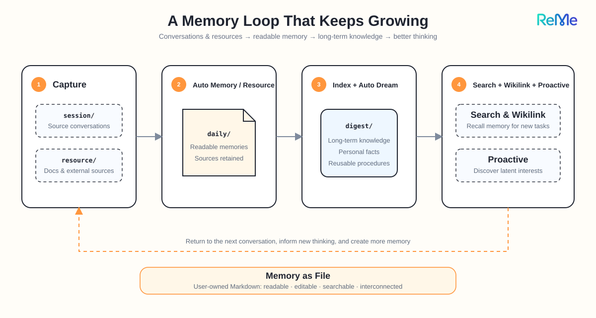
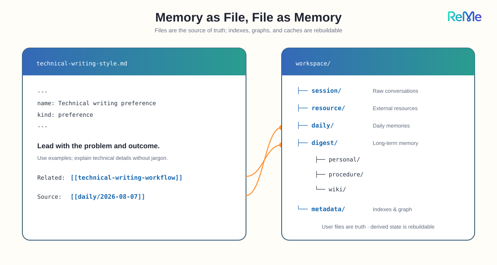
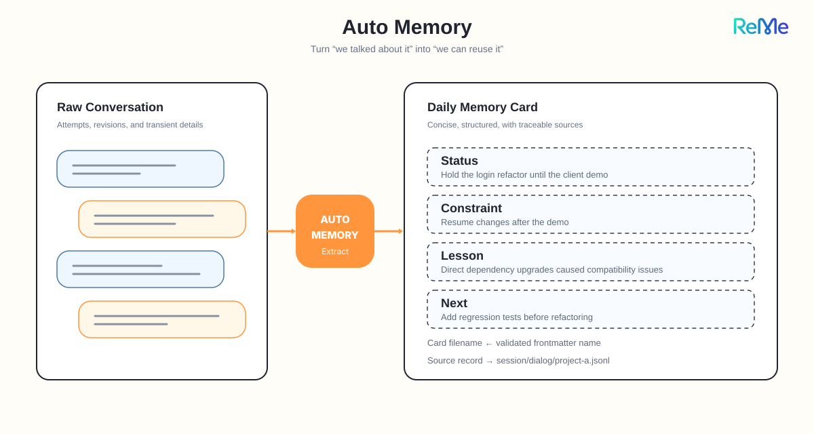
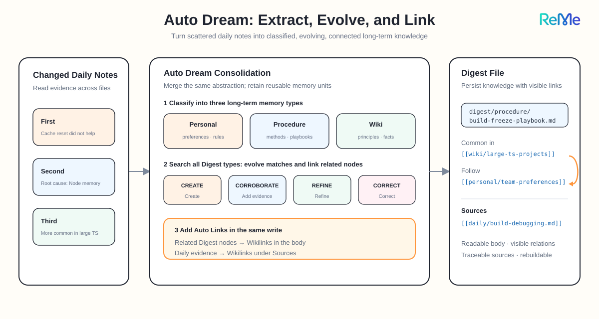
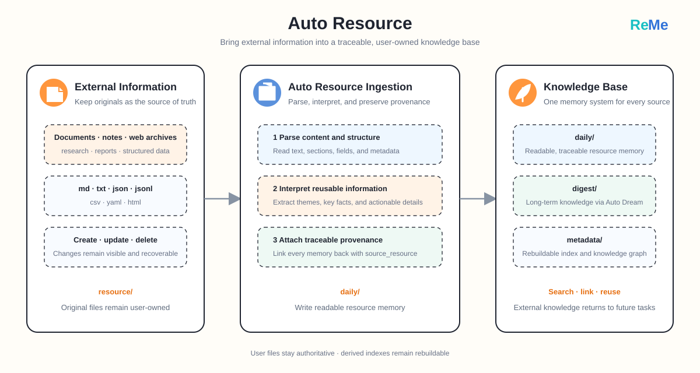
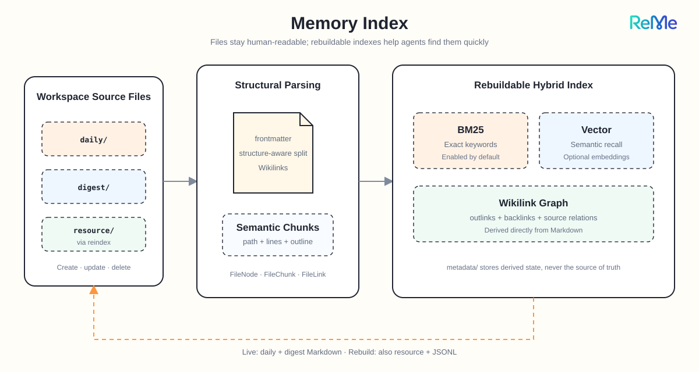
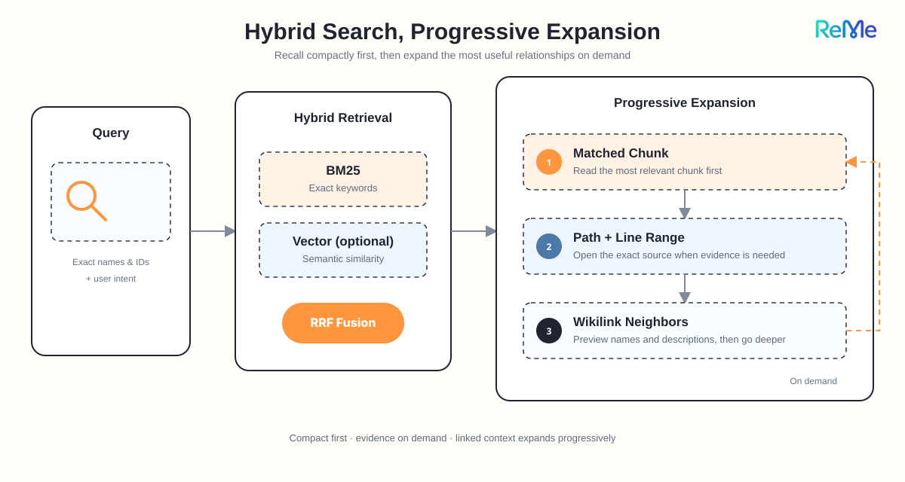
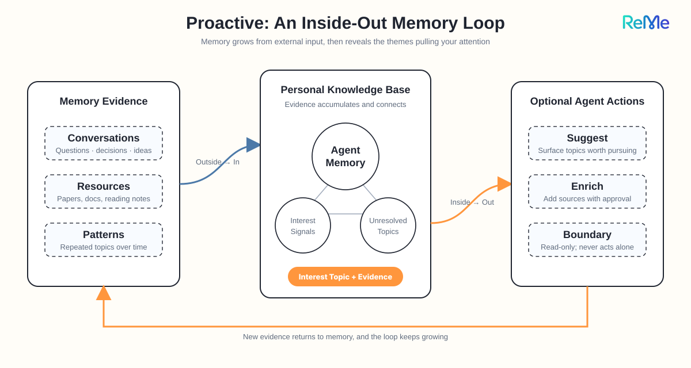

# ReMe：让你的个人知识库，在每一次对话后继续生长

我们每天都在和 AI 对话。

它帮我们分析项目、阅读论文、排查问题，也听我们讲过偏好、计划和那些还没完全想清楚的念头。

但大多数时候，对话结束，价值也被关进了历史记录。下一次打开新窗口，AI 可能还记得一句结论，却不知道结论从哪里来；可能搜到一段旧对话，却无法把它和后来读过的资料、做过的决定连起来。

真正有用的长期记忆，不应该只是“存过”，而应该能够持续整理、建立联系，并在未来需要时重新参与思考。

这正是 ReMe 想解决的事情。

> **ReMe 是一个面向 AI Agent 的、自进化的个人知识库。它让对话与资料持续沉淀为可读、可编辑、可检索、相互链接的 Markdown
记忆，并主动发现潜在兴趣。**

项目地址：[https://github.com/agentscope-ai/ReMe](https://github.com/agentscope-ai/ReMe)

项目文档：[https://docs.agentscope.io/reme](https://docs.agentscope.io/reme)

<p align="center">
  
</p>

## 一个会持续生长的记忆循环

<p align="center">
  
</p>

ReMe 不是另一个聊天机器人，也不试图替代你正在使用的 Agent。它更像一个可以被 QwenPaw、OpenClaw、Hermes、Claude Code 等 Agent
共享的本地记忆层。

它围绕一套普通文件，完成四件事：

这形成了一个 `capture → index → consolidate → recall` 的循环：

- 对话和外部资料先被保留下来；
- 有价值的信息被整理为每日记忆；
- 零散事件进一步合并为长期知识节点；
- 搜索、知识链接和主动兴趣发现，让旧记忆重新回到新的任务中。

更重要的是，这个循环的中心不是一个用户看不见的黑盒数据库，而是用户自己拥有的 Markdown 文件。索引、图谱和缓存都只是可重建的派生状态。

## 再看结果：它真的能从很长的历史里找回信息吗？

个人知识库可以写出很多漂亮的概念，但最终还是要回答一个朴素的问题：当对话越来越多、跨度越来越长时，Agent 还能不能找到正确的记忆？

ReMe 在 LongMemEval 和 BEAM 两套长期记忆基准上进行了验证。LongMemEval 关注跨会话信息能否被准确找回和推理；BEAM
则把超长对话切成多批会话，观察上下文规模扩大后，记忆能力是否仍然稳定。

| 基准                      | 规模或题型    |                样本量 | Agentic 得分 | 主要检验内容与结果                                        |
|---------------------------|---------------|----------------------:|-------------:|-----------------------------------------------------------|
| **LongMemEval cleaned-s** | **整体**      |            **500 题** |    **89.4%** | **验证跨会话检索、知识更新和时间推理能力**                |
| BEAM                      | 100K 上下文   |     20 cases / 400 题 |        66.1% | 在十类长上下文任务上建立基准表现                          |
| **BEAM**                  | **1M 上下文** | **35 cases / 700 题** |    **65.0%** | **上下文扩大到 10 倍后，Agentic 得分仅下降 1.1 个百分点** |

两套基准的任务、评分器和实验设置不同，分数不能直接横向比较。但结果共同表明，ReMe
能通过外部记忆与多轮搜索，支撑知识更新、多会话推理和长跨度检索，而不需要把全部历史一次性塞进上下文窗口。

## Memory as File：记忆首先是你的文件

<p align="center">
  
</p>

ReMe 的核心设计叫作： **Memory as File, File as Memory。**

“Memory as File”意味着，长期记忆不是藏在产品内部，而是落在 workspace 里的 Markdown、JSONL、YAML 和原始资源文件中。你可以用 VS
Code、Typora 或 Obsidian 直接打开，也可以用 Git、网盘或自己的同步方案备份和迁移。

“File as Memory”意味着，每个文件又不只是普通文本。它可以带有 YAML frontmatter、章节结构、行号范围和
Wikilink，成为一个可索引、可连接、可继续演化的记忆节点。

例如，一条关于写作偏好的长期记忆可以是：

```markdown
---
name: 用户偏好：技术文章风格
description: 喜欢先讲问题和结果，再解释技术细节，并用例子帮助理解。
kind: preference
---

用户希望技术文章有清晰主线，避免堆砌术语。

撰写文章时可参考 [[digest/procedure/技术内容写作流程.md]]。

## Sources

- [[daily/2026-08-07/content-discussion.md]]
```

几个月后，即使你已经忘了这次对话，Agent 仍然能读到偏好、找到关联流程，并顺着 `Sources` 回到当时的上下文。

这也是 ReMe 与“黑盒记忆”的关键区别：Agent 可以整理记忆，但用户永远保留查看、修正、移动和删除它的权利。

## Auto Memory：把聊过的事，写成每天的日记

<p align="center">
  
</p>

很多有价值的信息并不是以“请记住”开头的。

比如你在一次对话里说：

> “这周先不要重构登录模块，客户演示之后再做。上次直接升级依赖导致兼容问题，这次先补回归测试。”

这段话里同时包含了项目状态、时间约束、一次失败经验和后续行动。Auto Memory 会把它从聊天流水中提炼出来，写成当天的一张 daily
记忆卡片；原始对话则继续保存在 `session/dialog/` 中。

```text
session/dialog/project-a.jsonl       原始对话，负责可信
daily/2026-08-07/project-a.md        记忆卡片，负责好读
daily/2026-08-07.md                  当天索引，负责总览
```

以后再讨论登录模块，Agent 不必翻遍聊天记录，就能先看到：当前为什么没有重构、曾经踩过什么坑、下一步应该先做什么。

它像一位一直在场的记录者，但不是机械地抄写逐字稿，而是把“以后还会用到什么”整理出来。

## Auto Dream：让日记长成相互连接的长期知识

<p align="center">
  
</p>

日记多了，新的问题也会出现：信息虽然都在，却仍然散落在不同日期里。

假设你先后聊过三次同一个问题：

- 第一次排查构建卡死，清缓存无效；
- 第二次发现根因是 Node 内存不足；
- 第三次又补充了大型 TypeScript 项目下更容易触发这个问题。

Auto Dream 会一起扫描发生变化的 daily 文件，合并表达同一抽象的证据，只保留值得复用的记忆单元，再按内容写入三类长期记忆：

- `Personal`：用户、团队或项目特定的偏好、约定和约束；
- `Procedure`：可以再次执行的流程、方法和排查手册；
- `Wiki`：通用的定义、原则、观察和知识。

例如，上面的三次对话会被整理为 `digest/procedure/前端构建卡死排查.md`，包含触发条件、排查顺序、无效尝试、解决方法和适用边界，而不是三篇日记的简单拼接。

整合每个记忆单元时，Auto Dream 会先跨 `personal`、`procedure` 和 `wiki` 搜索已有节点，区分“同一抽象”和“相关知识”。同一抽象决定如何演化目标节点：

- `CREATE`：没有相同记忆，创建新节点；
- `CORROBORATE`：同一结论再次出现，补充来源并增强可信度；
- `REFINE`：新材料补全条件、步骤或细节；
- `CORRECT`：新信息修正旧结论。

相关知识则在同一次整合中以 Wikilink 写进正文，这就是 Auto Link。比如“前端构建卡死排查”可以同时连接通用知识、团队偏好和原始证据：

```markdown
这个问题常见于 [[digest/wiki/大型 TypeScript 项目.md]]，处理时遵循
[[digest/personal/团队变更偏好.md]] 中“先补回归测试”的约定。

## Sources

- [[daily/2026-08-07/build-debug.md|构建排查记录]] 提供了根因与适用场景。
```

知识的演化与链接发生在同一条流程里。关系不是藏在图数据库里的不可见边，而是正文中可读、可改的内容；文件可以重建图，图不会反过来绑架文件。

## Auto Resource：持续吸收外部资料

<p align="center">
  
</p>

Auto Resource 让外部信息不断进入用户自己拥有的知识库，成为可以回查、检索和复用的材料。目前它处于 Beta，只包含 Daily
Paper。未来还会持续加入更多资源工作流，例如用户感兴趣的金融新闻、雪球或微博大 V 的公开内容等，让个人知识库被持续关注的外部知识不断丰富。这些目前仍是扩展方向，并非已经上线的能力。

### Daily Paper：每天把论文推荐变成可检索的阅读记忆

Daily Paper 会从 Hugging Face 周榜和月榜收集论文，去除近期已经推荐过的内容，再进行排序、精选和 PDF
解读，生成中文论文笔记与一份约五分钟可读完的简报。

想象一下，你持续关注 Agent Memory：每天早上收到的不只是五个论文链接，而是五篇已经保存到本地的详细笔记。简报通过 Wikilink
指向原始笔记，原始笔记又能回到 PDF。一个月后再问“最近有哪些方法在做长期记忆压缩”，这些材料已经进入同一套检索系统，不需要重新从浏览器历史里寻找。

## Memory Index：普通文件，如何变成可搜索的记忆网络？

<p align="center">
  
</p>

Markdown 适合人读，但如果只是把文件堆进目录，Agent 仍然很难快速找到它们。ReMe 会持续监听 `daily/`、`digest/` 和 `resource/`
，将新增、修改和删除同步到可重建的索引中。

一份 Markdown 会被解析为：

- 一个文件节点：包含路径、frontmatter 等文件级信息；
- 多个语义 chunk：尽量沿标题、段落、列表和代码块边界切分，并保留章节骨架与行号；
- 多条 Wikilink 边：记录它指向谁，以及谁又指向它。

在检索侧，ReMe 可以组合三类信号：

| 检索信号       | 解决的问题                         | 例子                               |
|----------------|------------------------------------|------------------------------------|
| BM25 关键词    | 精确名称、术语和编号不能丢         | “宁德时代”“issue #184”             |
| Embedding 向量 | 用户换了一种说法，也要理解语义接近 | “构建卡死”与“打包阶段没有响应”     |
| Wikilink 图谱  | 命中一个节点后，看到它的上下游关系 | 从“钴”找到“三元正极”和相关调研记录 |

默认配置开箱启用 BM25 与 Wikilink 展开，Embedding 是可选能力，开启后才会参与向量召回。索引、图谱和缓存都写在 `metadata/`
，即使删除也可以根据用户的源文件重新构建。

## Memory Search：先找到答案，再沿着关系渐进展开

<p align="center">
  
</p>

很多 RAG 系统会一次性把 Top-K 文本全部塞进上下文。这样做简单，却容易带来两个问题：孤立切片缺少上下文，而把邻居正文全部展开又会迅速消耗
token。

ReMe 的混合搜索先让 BM25 与可选的向量检索各自召回候选，再使用 RRF 按排名融合。RRF 不强行比较 BM25
分数与余弦相似度这两种不同量纲，而是综合一个结果在两张榜单中的位置。

召回之后，信息按三层渐进式展开：

1. **先看命中片段**：返回最相关的 chunk、文件路径和行号；
2. **再看关系目录**：展示该文件的出链与入链，只给邻居的路径、名称、描述和锚点，不急着加载全文；
3. **最后按需深入**：Agent 判断哪条关系真正相关，再读取原文或沿图谱继续遍历。

例如，你问：“上次 Alice 推荐的那本讲注意力的书叫什么？”

第一步可能命中一张聚餐日记，其中只写着“标题里有‘深度’两个字”；结果同时显示，这张日记链接到了 Alice 的个人节点，也被《深度工作》的阅读笔记反向引用。

Agent 不需要把 Alice 的全部档案、所有读书笔记和整个月的日记都塞进上下文。它只要沿着最相关的链接再读一次，就能回答：

> 是《深度工作》。Alice 在那次聚餐时推荐了它，你后来还读了第三章并留下了笔记。

这更像人的联想过程：先想起一个片段，再顺藤摸瓜找到完整上下文。

## Proactive：从你的记忆里，发现那些尚未说出口的兴趣

<p align="center">
  
</p>

到这里，ReMe 已经有了两条不断丰富知识库的输入流：

- Auto Memory 从持续发生的对话中沉淀个人上下文；
- Auto Resource 通过 Daily Paper 从外部资料中补充新的知识，未来还会支持更多资源工作流。

Proactive 则把方向反过来：它从已经积累的对话和资料中，发现你反复关注、仍未解决或可能希望继续推进的主题。

例如，你最近一周分别聊过：

- 搜索结果里缺少来源；
- 长文档切片后容易失去章节上下文；
- 想比较几种 Agent Memory 评测方法。

你从未明确说“帮我系统研究记忆检索的可解释性”，但 Auto Dream 可以从这些 daily 记忆中提炼出一个兴趣主题：

```yaml
title: 记忆检索的可解释性与质量评测
reason: 用户近期持续关注来源追溯、结构化切片和记忆评测。
evidence: daily/2026-08-07/search-discussion.md
keywords:
  - memory search
  - source attribution
  - benchmark
```

上层 Agent 通过 Proactive 读取这个主题后，可以选择在合适的时机追问：“要不要把最近讨论过的检索问题整理成一份评测方案？”也可以据此启动一个经过用户授权的资料收集流程，让外部新知识围绕真正的个人兴趣反向进入知识库。

这里有一个重要边界： **ReMe 的 Proactive 本身只读取并暴露兴趣主题，不会擅自联网、推送或改写知识库。** 是否提醒、何时提醒、是否继续收集资料，由上层
Agent 和产品策略决定。

它不是凭空猜测你的兴趣，而是让那些已经出现在行为和对话中、却还没有被明确表达的线索浮出水面。

## 最后：真正属于个人的 AI 记忆，应该是什么样？

我们希望 Agent 越用越懂自己，但“懂”不应该建立在一个无法查看、无法修正、无法带走的黑盒上。

ReMe 给出的答案很朴素：

- 记忆是用户拥有的文件；
- 原始信息保留现场，长期知识保留抽象；
- 新对话和新资料持续进入，旧知识也持续被补充和修正；
- 每个结论都可以通过 Wikilink 找到关系和来源；
- 索引与缓存服务于文件，而不是取代文件；
- Agent 可以记住、整理、搜索和发现，但最终控制权始终属于用户。

当这些机制连接起来，个人知识库就不再是一座需要你手工维护的仓库。

它会在每一次对话后多记住一点，在每一份资料到来后多理解一点，在夜晚把零散经验重新整理，在未来的某个问题出现时，再沿着知识之间的联系，把真正需要的那段记忆带回来。

这就是 ReMe 想做的事： **让记忆不只被保存，也能持续进化。**

项目地址：[https://github.com/agentscope-ai/ReMe](https://github.com/agentscope-ai/ReMe)

项目文档：[https://docs.agentscope.io/reme](https://docs.agentscope.io/reme)

<p align="center">
  
</p>
