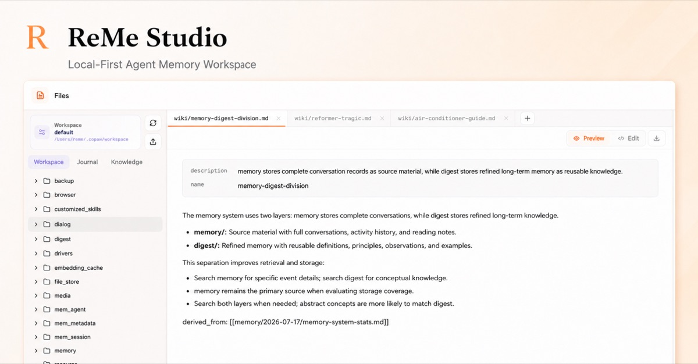

# ReMe Studio

[English](./README.md) | 简体中文

ReMe Studio 是 ReMe 的本地 Web 工作区。你可以在这里浏览和编辑自己拥有的工作区文件、探索记忆之间的联系，并与 ReMe Agent
对话，而无需将持久记忆迁移到独立的应用数据库中。搜索索引、图谱和其他派生元数据均可根据源文件重建。



## 安装

安装 Studio 和 ReMe 的可选集成功能：

```bash
pip install "reme-ai[core]"
```

如果只需要 Studio，不需要其他可选集成，可以使用 `pip install "reme-ai[web]"`。基础 `reme-ai` 包以无界面模式分发，
不包含前端资源。

## 功能

- **浏览工作区**：浏览完整工作区，或通过独立视图聚焦日记和知识文件；磁盘中的文件发生变化后，导航器会自动刷新。
- **Markdown 编辑与预览**：在多个标签页中打开文件，渲染 Markdown front matter 和 GitHub Flavored Markdown，使用 Monaco
  编辑器编辑，通过修改时间检查安全保存，并可将文件下载到本地。
- **记忆图谱**：查看知识库 `wiki`、`personal` 和 `procedure` 目录中已索引的 wikilink，检查入链和出链，并从图谱打开对应的
  Markdown 源文件。
- **Agent 对话**：与只读工作区 Agent 进行流式对话，查看工具调用和 token 用量，还可将工作区文件拖入对话作为引用。
- **服务管理**：查看服务及组件的内存使用情况、当前生效的脱敏配置和版本，并在不修改记忆源文件的情况下重建派生索引。
- **个性化设置**：切换中英文界面，并使用浅色、深色或跟随系统的外观。

## 环境要求

- Python 3.11 或更高版本，并已安装 ReMe。
- 正在运行的 ReMe HTTP 服务。Agent 对话还需要可用的 Agent 和模型配置。
- 只有从源码开发或构建 Studio 时才需要 Node.js 22.13 或更高版本。

ReMe 的安装和后端配置请参阅[仓库中文 README](../README_ZH.md)。

## 本地开发

先在仓库根目录启动 ReMe，然后在另一个终端运行前端：

```bash
# 终端 1：仓库根目录
reme start

# 终端 2
cd website
npm install
npm run dev
```

打开 <http://localhost:3000>。前端默认连接 `http://127.0.0.1:2333`，需要时可覆盖该地址：

```bash
NEXT_PUBLIC_REME_API_URL=http://127.0.0.1:8000 npm run dev
```

## 由 ReMe 托管的静态构建

ReMe 可以通过提供 HTTP API 的同一个 FastAPI 进程托管 Studio。构建静态版本并重启 ReMe：

```bash
cd website
npm ci
npm run build:static
cd ..
reme start
```

打开 <http://127.0.0.1:2333>。静态构建默认使用同源请求。进行独立的静态开发时，运行
`npm run dev:static`；如有需要，将 `VITE_REME_API_URL` 设置为正在运行的 ReMe 服务地址。

常规的 `npm run build` 命令仍用于 vinext/Sites 部署构建；`npm run build:static` 仅为 FastAPI 和 Python 包分发生成
`dist-static/`。

## 配置

工作区会隐藏点文件和点目录，并且默认只显示 Markdown 和文本文件。可以在 `.env.local` 中通过逗号分隔的列表配置允许显示的扩展名：

```bash
NEXT_PUBLIC_REME_WORKSPACE_EXTENSIONS=md,txt,mdx
```

记忆图谱依赖 ReMe 构建的索引。在 Studio 设置中重建索引时，只会根据工作区文件重新生成派生数据，不会修改记忆源文件。

## 检查

```bash
npm run format:check
npm run lint
npm run build
npm run build:static
npm test
```
